Experimental Validation
================
Roberto Olayo Alarcon and Medina Bajramovic
27/03/2024

In this file, we look at the output from the experimental validation.

``` r
library(tidyverse)
library(readxl)
```

## Prepare directories.

``` r
RAW_DATA_DIR <- "../raw_data/"
OUTPUT_DIR <- "../data/06.experimental_validation"

# Create output dir

if(!dir.exists(OUTPUT_DIR)){
  
  dir.create(OUTPUT_DIR)
  
}
```

## Read Optical Density.

Here we process the raw OD measurements from the machine. We perform
baseline correction and ignore first timepoint.

``` r
read_od_files <- function(file_name, input_directory, baseline_t=c(2, 3, 4), clip_lower=TRUE){
  
  #' Function to read and preprocess optical density (OD) files.
  #' 
  #' @param file_name A character string specifying the name of the OD file.
  #' @param input_directory A character string specifying the directory where the OD file is located.
  #' @param baseline_t An optional numeric vector specifying the timepoints to be used for baseline correction. Defaults to c(2, 3, 4).
  #' @param clip_lower An optional logical value indicating whether to clip negative values to zero. Defaults to TRUE.
  #' 
  #' @return A data frame containing the preprocessed OD data in long format, with additional columns for timepoint, time spent in the incubator (in hours), well identifier, OD readings, file origin, organism, and replicate.
  #' 
  #' The function reads an OD file from the specified directory, performs baseline correction, clips lower values (if specified), 
  #' adds time-related columns, transforms the data into long format, and adds additional information such as file origin, organism, and replicate.
  #' The preprocessed data is returned as a data frame.
  #' 
  
  # Read file
  file_path <- file.path(input_directory, file_name)
  timeseries_df <- read.table(file_path, sep='\t', header = TRUE) %>% 
    column_to_rownames("Time")
  
  # Baseline correction. We look for the minimum of the timepoints specified for each well
  well_minimums <- timeseries_df %>% 
    
    # Only look at specicied timepoints
    slice(baseline_t) %>% 
    
    # Gather the minimum of each well
    summarise(across(where(is.numeric), min)) %>% 
    unlist()
  
   # Subtract baseline
  timeseries_df <- sweep(timeseries_df, 2, well_minimums)
  
  
  # Clip values
  if(clip_lower){
    
    timeseries_df[timeseries_df < 0] <- 0
  }
  
  # Add timepoint columns
  timeseries_df <- timeseries_df %>% 
    
    # Add Time column
    rownames_to_column("Time") %>% 
    
    # Add timepoint
    mutate(timepoint = 1:n())
  
  
  # Add time spent in incubator (in hours)
  
  ## Add time 0
  t0 <- strptime(timeseries_df$Time[1],  format = "%m/%d/%Y %H:%M:%S", tz = "CET")
  
  timeseries_df <- timeseries_df %>% 
    ## Format time-stamps
    mutate(time_format = strptime(Time,  format = "%m/%d/%Y %H:%M:%S", tz = "CET"),
           
           # Time spent in incubator
           time_spent_h = as.numeric(time_format - t0, units="hours")) %>% 
    
    select(-time_format)
    
  
  
  # Long format
  timeseries.long <- timeseries_df %>% 
    pivot_longer(cols = -c(timepoint, Time, time_spent_h), names_to = "well", values_to = "od")
  
  
  # Add information
  
  ## Join ecoli strains
  assay.id <- if_else(str_count(file_name, "_") == 3, str_remove(file_name, "_"), file_name)
  assay.id <- str_remove(assay.id, "_OD.tsv.gz")
  
  
  timeseries.long <- timeseries.long %>% 
    mutate(file_origin = file_name,
           organism_replicate = assay.id) %>% 
    
    separate(organism_replicate, sep = "_", into = c("organism", "replicate"))
  
  return(timeseries.long)
  
}
```

Now we iterate over all OD files

``` r
# Directory for od files
input_directory <- file.path(RAW_DATA_DIR, "experimental_validation", "od_files")
input_files <- list.files(input_directory)

# Process OD
complete_od <- bind_rows(lapply(input_files, read_od_files, input_directory=input_directory))

# Write processed OD
write_tsv(x=complete_od, file = file.path(OUTPUT_DIR, "complete_od.tsv.gz"))
```

Now we read the metadata

``` r
well_metadata <- read_excel(file.path(RAW_DATA_DIR, "experimental_validation", "lib_map.xlsx")) %>% 
  
  select(-well_code) %>% 
  
  mutate(concentration = as.numeric(concentration),
         dmso_percentage = as.numeric(dmso_percentage))
```

What is important to note here is that now, each well refers to a
specific **Compound - Concentration**. At the same time, we have an
additional column that tells us the amount of DMSO used for the specific
preparation.

This validation plate has 96 wells in total. We test this setup against
5 microbial strains in triplicate. This means that we will end up having
a grand total of **96 x 5 x 3 = 1,440** individual growth curves. On top
of this, *Escherichia coli IAI* was tested twice against this plate,
meaning that we have an additional **288** curves. **This gives us a
total of 1,728 growth curves.**

Now that we have all of the data, we can add the metadata to our growth
data.

``` r
# Add information
complete_od <- complete_od %>% 
  select(-c(Time, file_origin)) %>% 
  left_join(well_metadata, by="well") %>% 
  
  # Remove noisy timepoints. 
  filter(timepoint >= 2) %>% 
  
  mutate(curve_id = paste(organism, well, replicate, sep="_"))

# Count number of curves  
complete_od %>% 
  select(curve_id) %>% 
  n_distinct()
```

    ## [1] 1728

## Explore experiments.

Now, we can get a general idea of the results from our experiments!

``` r
all_data_plot <- complete_od %>% 
  filter(compound != "DMSO") %>% 
  
  ggplot(aes(x=time_spent_h, y=od, group=curve_id, color=log2(concentration))) +
  geom_line(linewidth=0.2) +
  
  #scale_color_distiller(palette = "PuRd") +
  
  facet_grid(organism~compound) +
  theme_light() +
  theme(legend.position = "bottom") +
  ggtitle("Experimental results - Compound x Organism")


all_data_plot
```

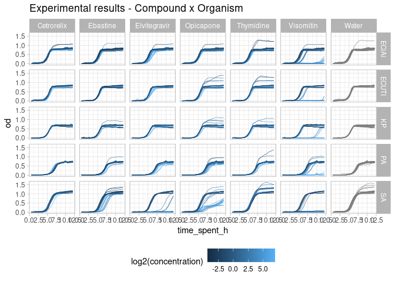<!-- -->

From this we can see that Visomitin is active against Gram negative and
Gram positive bacteria, as we predicted. This is a very neat result!
Unfortunately, *Visomitin* is one name this compound has. It’s generic
name is *SKQ1*, and this has already been shown to be active against a
variety of bacterial species [Nazarov P.A.,
2017](https://www.nature.com/articles/s41598-017-00802-8).

We also see that *Staphylococcus aureus* is suceptible to Elivitegravir
and also sensitive to Opicapone. There is also some indications that
Ebastine affects growth. Now we can take a closer look at each compound
individually.

## Baseline growth (Water and DMSO).

It’s worth to take a closer look at growth under DMSO and Water to look
for outliers.

## DMSO

``` r
complete_od %>% 
  filter(compound == "DMSO") %>%
  mutate(Conc = factor(concentration, levels=sort(unique(concentration)))) %>% 
  
  ggplot(aes(x=timepoint, y=od, group=curve_id, color=concentration)) +
  geom_line(linewidth=0.25) +
  
  #scale_color_brewer(palette = "Paired") +
  scale_color_distiller(palette = "PuRd") +
  
  geom_vline(xintercept = 9, color="white", linetype="longdash")+
  
  facet_wrap(~organism, nrow = 2, ncol = 4) +
  theme_dark() 
```

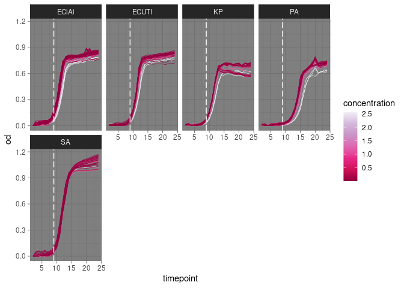<!-- -->

It seems like DMSO does have an effect on the growth of our Gram
negative strains!

## Water

``` r
complete_od %>% 
  filter(compound == "Water") %>% 
  mutate(row_letter = sapply(well, function(x){str_split(x, "", simplify = TRUE)[,1]})) %>% 
  
  ggplot(aes(x=time_spent_h, y=od, group=curve_id, color=row_letter)) +
  geom_line() +
  
  geom_vline(xintercept = 6, color="black", linetype="longdash") +
  scale_color_brewer(palette = "Set1") +
  
  facet_wrap(~organism, nrow = 2, ncol = 4) +
  theme_light() 
```

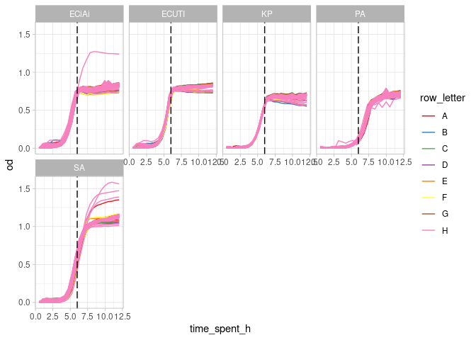<!-- -->

Seems like there might be some outliers with overgrowth for *S. aureus*,
*P. aeruginosa*, and *E. coli* IAi.

``` r
complete_od %>% 
  filter(compound == "Water", organism=="SA") %>% 
  mutate(row_letter = sapply(well, function(x){str_split(x, "", simplify = TRUE)[,1]})) %>% 
  #filter(row_letter == "H") %>% 
  
  ggplot(aes(x=time_spent_h, y=od, group=curve_id, color=replicate, linetype=replicate)) +
  geom_line() +
  
  facet_wrap(~well) +
  theme_light() +
  ggtitle("SA - Water")
```

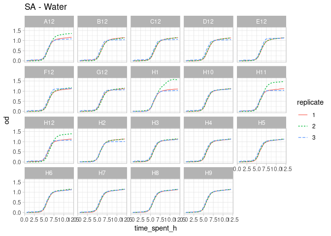

``` r
complete_od %>% 
  filter(compound == "Water", organism=="PA") %>% 
  mutate(row_letter = sapply(well, function(x){str_split(x, "", simplify = TRUE)[,1]})) %>% 
  #filter(row_letter == "H") %>% 
  
  ggplot(aes(x=time_spent_h, y=od, group=curve_id, color=replicate, linetype=replicate)) +
  geom_line() +
  
  facet_wrap(~well) +
  theme_light() +
  ggtitle("PA - Water")
```

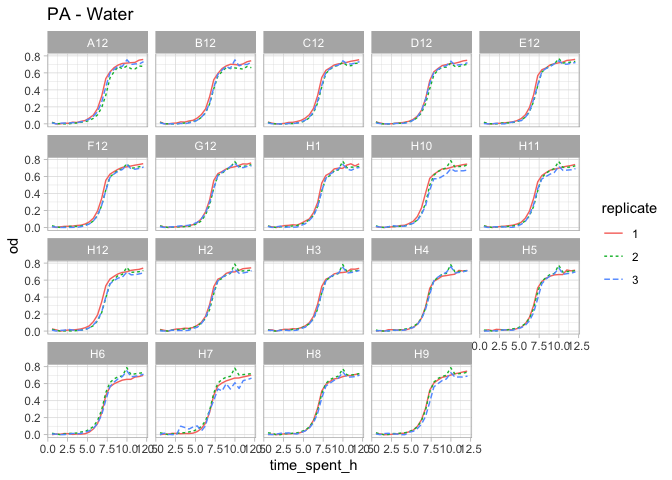

``` r
complete_od %>% 
  filter(compound == "Water", organism=="ECiAi") %>% 
  mutate(row_letter = sapply(well, function(x){str_split(x, "", simplify = TRUE)[,1]})) %>% 
  #filter(row_letter == "H") %>% 
  
  ggplot(aes(x=time_spent_h, y=od, group=curve_id, color=replicate, linetype=replicate)) +
  geom_line() +

  facet_wrap(~well) +
  theme_light() +
  ggtitle("ECiAi - Water")
```

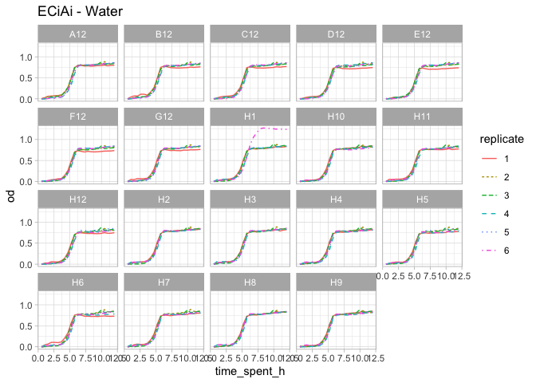

Given the plots above, I think it makes sense to remove the following
curves and consider them as outliers.

``` r
outlier_water <- c("SA_H1_2", "SA_H11_2", "SA_H12_2", "SA_A12_2", "ECiAi_H1_6", "PA_H7_3")

complete_od <- complete_od %>% 
  filter(!(curve_id %in% outlier_water))
```

## Visualize Concentration X Organism panel.

In this section we explore the effects of each compound.

``` r
# Create output panel directory
OUTPUT_PANEL_PLOTS_DIR <- file.path(OUTPUT_DIR, "organism_concentration_plots")

if(!dir.exists(OUTPUT_PANEL_PLOTS_DIR)){
  
  dir.create(OUTPUT_PANEL_PLOTS_DIR)
}
```

``` r
# THIS function looks a bit more specifically at a given compound_concentration combination. Here we do give 
# a bit more attention when selecting the correct DMSO curves and the correct Water curves.

gather_baseline <- function(cname, conc_i, growth_df, info_df){
  
  #' Gather baseline data for a specific compound and concentration.
  #'
  #' This function retrieves baseline data necessary for calculating the mean growth curve of a compound.
  #' It identifies the row letter corresponding to the compound of interest, gathers water wells from row H and the end of the row containing the compound,
  #' selects the DMSO well with the concentration used in compound dilution, and combines water and DMSO data into one dataframe.
  #'
  #' @param cname A character specifying the name of the compound for which baseline data is to be gathered.
  #' @param conc_i The concentration of the compound for which baseline data is to be gathered.
  #' @param growth_df A dataframe containing growth data for wells.
  #' @param info_df A dataframe containing information about wells, such as compound and concentration.
  #'
  #' @return A dataframe representing the baseline data, including water and DMSO wells.
  #'
  #' @examples
  #' gather_baseline("compound_name", 0.1, growth_data, well_info)
  #'
  
  # We gather the row letter that corresponds to our compound of interest.
  compound_row <- growth_df %>% 
    mutate(row_letter = str_split(well, "", simplify = TRUE)[,1]) %>% 
    select(row_letter, compound) %>% 
    distinct() %>% 
    filter(compound == cname) %>% 
    select(row_letter) %>% 
    unlist()
  
  # Now we can gather the Water wells corresponding to row H and the water well at the end of the row of our compound of interest
  water_data <- growth_df %>% 
    mutate(row_letter = str_split(well, "", simplify = TRUE)[,1]) %>% 
    filter(compound == "Water", row_letter %in% c("H", compound_row)) %>% 
    select(-row_letter)
  
  # We should select the DMSO well with the concentration of DMSO used in the compound dilution
  dmso_perc <- well_metadata %>% 
    filter(compound == cname, concentration == conc_i) %>% 
    select(dmso_percentage) %>% 
    unlist()
  
  # In a situation were no DMSO was used, we can just show the lowest concentration
  if(dmso_perc == 0){
    dmso_perc = 0.002
  }
  
  # Now we gather the corresponding well
  dmso_well <- info_df %>% 
  filter(compound == "DMSO", concentration == dmso_perc) %>% 
  select(well) %>% 
  unlist()

  dmso_data <- growth_df %>% 
    filter(well==dmso_well)
  
  
  # Now that we have DMSO and Water, we combine them into one dataframe
  baseline_data <- bind_rows(water_data, dmso_data)
  return(baseline_data)
  
}


## Gather average OD measurements

gather_mean_data <- function(input_str, chem_data = complete_od, meta_df=well_metadata, deliver="mean_od"){
  
  #' Gather mean data for a specific combination of organism, compound, and concentration.
  #'
  #' This function retrieves mean data for a given combination of organism, compound, and concentration from the complete optical density measurements dataframe.
  #' Depending on the 'deliver' parameter, it can return either the complete optical density data for the specified combination, the mean growth curve, or both.
  #'
  #' @param input_str A character string representing the combination of organism, compound, and concentration (e.g., "organism-compound-concentration").
  #' @param chem_data A dataframe containing complete optical density measurements. Defaults to complete_od.
  #' @param meta_df A dataframe containing metadata information about wells. Defaults to well_metadata.
  #' @param deliver A character specifying what to deliver: "mean_od" for mean growth curve, "allcurve_od" for complete optical density data,
  #'                and "both" for both mean growth curve and complete optical density data. Defaults to "mean_od".
  #'
  #' @return Depending on the 'deliver' parameter, it returns either the mean growth curve (dataframe), the all optical density data (dataframe), or both (list of dataframes).
  #'
  #' @examples
  #' gather_mean_data("SA-Ebastine-128")
    
  
  # Extract relevant combos
  split_data <- str_split(input_str, "-", simplify = TRUE)

  org_str <- split_data[,1]
  compound_i <- split_data[,2]
  concentration_i <- as.numeric(split_data[,3])
  
  
  # First, we gather the data for our organism of interest
  od_organism <- chem_data %>% 
    filter(organism == org_str)
  
  # Now we gather the correct baseline data
  baseline_od <- gather_baseline(compound_i, concentration_i, od_organism, meta_df)
  
  # Now we gather the data for our compound - concentration of interest
  chem_od <- od_organism %>% 
    filter(compound == compound_i, concentration == concentration_i) %>% 
    mutate(compound = factor(compound, levels = c("Water", "DMSO", compound_i)))
  
  # Join everthing
  allcurves_od <- bind_rows(baseline_od, chem_od)
  
  if(deliver == "allcurve_od"){
    return(allcurves_od)
  }
  
  # Now we can gather the mean growth curve of each compound
  meancurves_od <- allcurves_od %>% 
    group_by(compound, timepoint) %>% 
    summarise(mean_od = mean(od), stdv = sd(od)) %>% 
    
    mutate(curve_id = compound) %>% 
    ungroup() %>% 
    
    mutate(organism = org_str,
           compound = compound_i,
           concentration = concentration_i)
  
  if(deliver == "mean_od"){
    return(meancurves_od)
  }
  
  if(deliver == "both"){
    return(list("allcurve_od"=allcurves_od, "meancurve_od"=meancurves_od))
    }
}


gather_panel <- function(compound_name, meta_df=well_metadata, chem_od = complete_od){
  
  #' Gather data for a given compound from a panel of organisms with associated concentrations.
  #'
  #' This function takes a compound name and retrieves relevant data from the chemical optical density measurements dataframe.
  #' Finally, it gathers mean data for all organism-concentration-compound combinations and returns the complete panel.
  #'
  #' @param compound_name A character specifying the name of the compound for which data is to be gathered.
  #' @param meta_df A dataframe containing metadata information about wells. Defaults to well_metadata.
  #' @param chem_od A dataframe containing chemical optical density measurements. Defaults to complete_od.
  #'
  #' @return A dataframe representing the complete panel of organism-concentration-compound combinations.
  #'
  #' @examples
  #' gather_panel("Visomitin")
    
  # Gather the relevant data for a given compound
  all_chem_combinations <- chem_od %>% 
    filter(compound == compound_name) %>% 
    select(organism, compound, concentration) %>% 
    distinct() %>% 
    
    # Create a string with all info
    unite(col = combo_str, organism, compound, concentration, sep="-") %>% 
    select(combo_str) %>% 
    unlist()
  
  
  # Gather the data for all organism-concentration-compound combinations
  complete_panel <- bind_rows(lapply(all_chem_combinations, gather_mean_data))
  
  
  return(complete_panel)
  
  
  
  
}
```

``` r
# Gather the average amount of time spent for each timepoint
time_df <- complete_od %>% 
  select(timepoint, time_spent_h) %>% 
  distinct() %>% 
  group_by(timepoint) %>% 
  summarise(time_spent_avg = mean(time_spent_h))
```

### Visomitin

``` r
viso.panel.data <- gather_panel("Visomitin") %>% 
  
  left_join(time_df, by="timepoint") %>% 
  mutate(organism = case_when(organism == "ECiAi" ~ "EC IAI1",
                              organism == "ECUTI" ~ "EC UTI",
                              TRUE ~ organism)) %>% 
  filter(curve_id != "Water")


viso.panel <- ggplot(viso.panel.data, aes(x=time_spent_avg, y=mean_od, ymin = mean_od - stdv, ymax = mean_od + stdv, color=curve_id)) +
  
  geom_line() +
  geom_pointrange(size=0.1, alpha=0.5) +
  
  facet_grid(concentration~organism) +
  
  scale_color_manual(values=c("#1f78b4", "#e7298a"),
                     breaks = c("DMSO", "Visomitin")) +
  
  theme_light() +
  theme(legend.position = "bottom",
        axis.text = element_text(size = 5)) +
  
  scale_x_continuous(breaks = 1:12) +
  
  labs(x="Time (hours)",
       y=latex2exp::TeX("$OD_{600}$"),
       color="Compound")


viso.panel
```

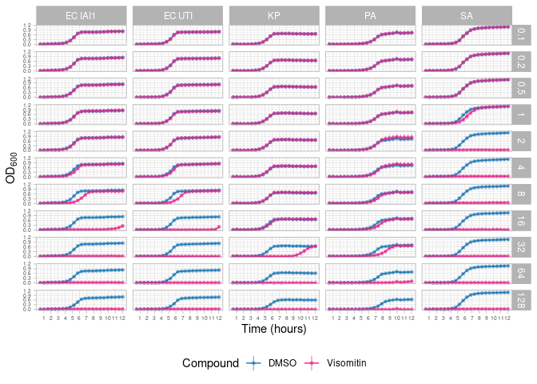<!-- -->

``` r
ggsave(plot=viso.panel, filename = file.path(OUTPUT_PANEL_PLOTS_DIR, "visomitin_panel.pdf"), width = 21, height = 25, units = "cm")
```

### Elvitegravir.

``` r
elvi.panel.data <- gather_panel("Elvitegravir") %>% 
  
  left_join(time_df, by="timepoint") %>% 
  mutate(organism = case_when(organism == "ECiAi" ~ "EC IAI1",
                              organism == "ECUTI" ~ "EC UTI",
                              TRUE ~ organism)) %>% 
  filter(curve_id != "Water")
```

    ## `summarise()` has grouped output by 'compound'. You can override using the
    ## `.groups` argument.
    ## `summarise()` has grouped output by 'compound'. You can override using the
    ## `.groups` argument.
    ## `summarise()` has grouped output by 'compound'. You can override using the
    ## `.groups` argument.
    ## `summarise()` has grouped output by 'compound'. You can override using the
    ## `.groups` argument.
    ## `summarise()` has grouped output by 'compound'. You can override using the
    ## `.groups` argument.
    ## `summarise()` has grouped output by 'compound'. You can override using the
    ## `.groups` argument.
    ## `summarise()` has grouped output by 'compound'. You can override using the
    ## `.groups` argument.
    ## `summarise()` has grouped output by 'compound'. You can override using the
    ## `.groups` argument.
    ## `summarise()` has grouped output by 'compound'. You can override using the
    ## `.groups` argument.
    ## `summarise()` has grouped output by 'compound'. You can override using the
    ## `.groups` argument.
    ## `summarise()` has grouped output by 'compound'. You can override using the
    ## `.groups` argument.
    ## `summarise()` has grouped output by 'compound'. You can override using the
    ## `.groups` argument.
    ## `summarise()` has grouped output by 'compound'. You can override using the
    ## `.groups` argument.
    ## `summarise()` has grouped output by 'compound'. You can override using the
    ## `.groups` argument.
    ## `summarise()` has grouped output by 'compound'. You can override using the
    ## `.groups` argument.
    ## `summarise()` has grouped output by 'compound'. You can override using the
    ## `.groups` argument.
    ## `summarise()` has grouped output by 'compound'. You can override using the
    ## `.groups` argument.
    ## `summarise()` has grouped output by 'compound'. You can override using the
    ## `.groups` argument.
    ## `summarise()` has grouped output by 'compound'. You can override using the
    ## `.groups` argument.
    ## `summarise()` has grouped output by 'compound'. You can override using the
    ## `.groups` argument.
    ## `summarise()` has grouped output by 'compound'. You can override using the
    ## `.groups` argument.
    ## `summarise()` has grouped output by 'compound'. You can override using the
    ## `.groups` argument.
    ## `summarise()` has grouped output by 'compound'. You can override using the
    ## `.groups` argument.
    ## `summarise()` has grouped output by 'compound'. You can override using the
    ## `.groups` argument.
    ## `summarise()` has grouped output by 'compound'. You can override using the
    ## `.groups` argument.
    ## `summarise()` has grouped output by 'compound'. You can override using the
    ## `.groups` argument.
    ## `summarise()` has grouped output by 'compound'. You can override using the
    ## `.groups` argument.
    ## `summarise()` has grouped output by 'compound'. You can override using the
    ## `.groups` argument.
    ## `summarise()` has grouped output by 'compound'. You can override using the
    ## `.groups` argument.
    ## `summarise()` has grouped output by 'compound'. You can override using the
    ## `.groups` argument.
    ## `summarise()` has grouped output by 'compound'. You can override using the
    ## `.groups` argument.
    ## `summarise()` has grouped output by 'compound'. You can override using the
    ## `.groups` argument.
    ## `summarise()` has grouped output by 'compound'. You can override using the
    ## `.groups` argument.
    ## `summarise()` has grouped output by 'compound'. You can override using the
    ## `.groups` argument.
    ## `summarise()` has grouped output by 'compound'. You can override using the
    ## `.groups` argument.
    ## `summarise()` has grouped output by 'compound'. You can override using the
    ## `.groups` argument.
    ## `summarise()` has grouped output by 'compound'. You can override using the
    ## `.groups` argument.
    ## `summarise()` has grouped output by 'compound'. You can override using the
    ## `.groups` argument.
    ## `summarise()` has grouped output by 'compound'. You can override using the
    ## `.groups` argument.
    ## `summarise()` has grouped output by 'compound'. You can override using the
    ## `.groups` argument.
    ## `summarise()` has grouped output by 'compound'. You can override using the
    ## `.groups` argument.
    ## `summarise()` has grouped output by 'compound'. You can override using the
    ## `.groups` argument.
    ## `summarise()` has grouped output by 'compound'. You can override using the
    ## `.groups` argument.
    ## `summarise()` has grouped output by 'compound'. You can override using the
    ## `.groups` argument.
    ## `summarise()` has grouped output by 'compound'. You can override using the
    ## `.groups` argument.
    ## `summarise()` has grouped output by 'compound'. You can override using the
    ## `.groups` argument.
    ## `summarise()` has grouped output by 'compound'. You can override using the
    ## `.groups` argument.
    ## `summarise()` has grouped output by 'compound'. You can override using the
    ## `.groups` argument.
    ## `summarise()` has grouped output by 'compound'. You can override using the
    ## `.groups` argument.
    ## `summarise()` has grouped output by 'compound'. You can override using the
    ## `.groups` argument.
    ## `summarise()` has grouped output by 'compound'. You can override using the
    ## `.groups` argument.
    ## `summarise()` has grouped output by 'compound'. You can override using the
    ## `.groups` argument.
    ## `summarise()` has grouped output by 'compound'. You can override using the
    ## `.groups` argument.
    ## `summarise()` has grouped output by 'compound'. You can override using the
    ## `.groups` argument.
    ## `summarise()` has grouped output by 'compound'. You can override using the
    ## `.groups` argument.

``` r
elvi.panel <- ggplot(elvi.panel.data, aes(x=time_spent_avg, y=mean_od, ymin = mean_od - stdv, ymax = mean_od + stdv, color=curve_id)) +
  
  geom_line() +
  geom_pointrange(size=0.1, alpha=0.5) +
  
  facet_grid(concentration~organism) +
  
  scale_color_manual(values=c("#1f78b4", "#e7298a"),
                     breaks = c("DMSO", "Elvitegravir")) +
  
  theme_light() +
  theme(legend.position = "bottom",
        axis.text = element_text(size = 5)) +
  
  scale_x_continuous(breaks = 1:12) +
  
  labs(x="Time (hours)",
       y=latex2exp::TeX("$OD_{600}$"),
       color="Compound")


elvi.panel
```

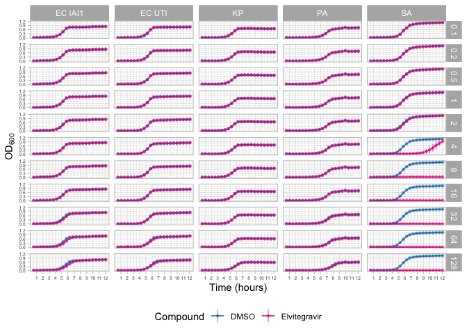<!-- -->

``` r
ggsave(plot=elvi.panel, filename = file.path(OUTPUT_PANEL_PLOTS_DIR, "elvitegravir_panel.pdf"), width = 21, height = 25, units = "cm")
```

### Ebastine.

``` r
ebas.panel.data <- gather_panel("Ebastine") %>% 
  
  left_join(time_df, by="timepoint") %>% 
  mutate(organism = case_when(organism == "ECiAi" ~ "EC IAI1",
                              organism == "ECUTI" ~ "EC UTI",
                              TRUE ~ organism)) %>% 
  filter(curve_id != "Water")
```

    ## `summarise()` has grouped output by 'compound'. You can override using the
    ## `.groups` argument.
    ## `summarise()` has grouped output by 'compound'. You can override using the
    ## `.groups` argument.
    ## `summarise()` has grouped output by 'compound'. You can override using the
    ## `.groups` argument.
    ## `summarise()` has grouped output by 'compound'. You can override using the
    ## `.groups` argument.
    ## `summarise()` has grouped output by 'compound'. You can override using the
    ## `.groups` argument.
    ## `summarise()` has grouped output by 'compound'. You can override using the
    ## `.groups` argument.
    ## `summarise()` has grouped output by 'compound'. You can override using the
    ## `.groups` argument.
    ## `summarise()` has grouped output by 'compound'. You can override using the
    ## `.groups` argument.
    ## `summarise()` has grouped output by 'compound'. You can override using the
    ## `.groups` argument.
    ## `summarise()` has grouped output by 'compound'. You can override using the
    ## `.groups` argument.
    ## `summarise()` has grouped output by 'compound'. You can override using the
    ## `.groups` argument.
    ## `summarise()` has grouped output by 'compound'. You can override using the
    ## `.groups` argument.
    ## `summarise()` has grouped output by 'compound'. You can override using the
    ## `.groups` argument.
    ## `summarise()` has grouped output by 'compound'. You can override using the
    ## `.groups` argument.
    ## `summarise()` has grouped output by 'compound'. You can override using the
    ## `.groups` argument.
    ## `summarise()` has grouped output by 'compound'. You can override using the
    ## `.groups` argument.
    ## `summarise()` has grouped output by 'compound'. You can override using the
    ## `.groups` argument.
    ## `summarise()` has grouped output by 'compound'. You can override using the
    ## `.groups` argument.
    ## `summarise()` has grouped output by 'compound'. You can override using the
    ## `.groups` argument.
    ## `summarise()` has grouped output by 'compound'. You can override using the
    ## `.groups` argument.
    ## `summarise()` has grouped output by 'compound'. You can override using the
    ## `.groups` argument.
    ## `summarise()` has grouped output by 'compound'. You can override using the
    ## `.groups` argument.
    ## `summarise()` has grouped output by 'compound'. You can override using the
    ## `.groups` argument.
    ## `summarise()` has grouped output by 'compound'. You can override using the
    ## `.groups` argument.
    ## `summarise()` has grouped output by 'compound'. You can override using the
    ## `.groups` argument.
    ## `summarise()` has grouped output by 'compound'. You can override using the
    ## `.groups` argument.
    ## `summarise()` has grouped output by 'compound'. You can override using the
    ## `.groups` argument.
    ## `summarise()` has grouped output by 'compound'. You can override using the
    ## `.groups` argument.
    ## `summarise()` has grouped output by 'compound'. You can override using the
    ## `.groups` argument.
    ## `summarise()` has grouped output by 'compound'. You can override using the
    ## `.groups` argument.
    ## `summarise()` has grouped output by 'compound'. You can override using the
    ## `.groups` argument.
    ## `summarise()` has grouped output by 'compound'. You can override using the
    ## `.groups` argument.
    ## `summarise()` has grouped output by 'compound'. You can override using the
    ## `.groups` argument.
    ## `summarise()` has grouped output by 'compound'. You can override using the
    ## `.groups` argument.
    ## `summarise()` has grouped output by 'compound'. You can override using the
    ## `.groups` argument.
    ## `summarise()` has grouped output by 'compound'. You can override using the
    ## `.groups` argument.
    ## `summarise()` has grouped output by 'compound'. You can override using the
    ## `.groups` argument.
    ## `summarise()` has grouped output by 'compound'. You can override using the
    ## `.groups` argument.
    ## `summarise()` has grouped output by 'compound'. You can override using the
    ## `.groups` argument.
    ## `summarise()` has grouped output by 'compound'. You can override using the
    ## `.groups` argument.
    ## `summarise()` has grouped output by 'compound'. You can override using the
    ## `.groups` argument.
    ## `summarise()` has grouped output by 'compound'. You can override using the
    ## `.groups` argument.
    ## `summarise()` has grouped output by 'compound'. You can override using the
    ## `.groups` argument.
    ## `summarise()` has grouped output by 'compound'. You can override using the
    ## `.groups` argument.
    ## `summarise()` has grouped output by 'compound'. You can override using the
    ## `.groups` argument.
    ## `summarise()` has grouped output by 'compound'. You can override using the
    ## `.groups` argument.
    ## `summarise()` has grouped output by 'compound'. You can override using the
    ## `.groups` argument.
    ## `summarise()` has grouped output by 'compound'. You can override using the
    ## `.groups` argument.
    ## `summarise()` has grouped output by 'compound'. You can override using the
    ## `.groups` argument.
    ## `summarise()` has grouped output by 'compound'. You can override using the
    ## `.groups` argument.
    ## `summarise()` has grouped output by 'compound'. You can override using the
    ## `.groups` argument.
    ## `summarise()` has grouped output by 'compound'. You can override using the
    ## `.groups` argument.
    ## `summarise()` has grouped output by 'compound'. You can override using the
    ## `.groups` argument.
    ## `summarise()` has grouped output by 'compound'. You can override using the
    ## `.groups` argument.
    ## `summarise()` has grouped output by 'compound'. You can override using the
    ## `.groups` argument.

``` r
ebas.panel <- ggplot(ebas.panel.data, aes(x=time_spent_avg, y=mean_od, ymin = mean_od - stdv, ymax = mean_od + stdv, color=curve_id)) +
  
  geom_line() +
  geom_pointrange(size=0.1, alpha=0.5) +
  
  facet_grid(concentration~organism) +
  
  scale_color_manual(values=c("#1f78b4", "#e7298a"),
                     breaks = c("DMSO", "Ebastine")) +
  
  theme_light() +
  theme(legend.position = "bottom",
        axis.text = element_text(size = 5)) +
  
  scale_x_continuous(breaks = 1:12) +
  
  labs(x="Time (hours)",
       y=latex2exp::TeX("$OD_{600}$"),
       color="Compound")


ebas.panel
```

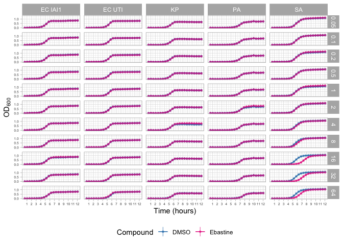<!-- -->

``` r
ggsave(plot=ebas.panel, filename = file.path(OUTPUT_PANEL_PLOTS_DIR, "ebastine_panel.pdf"), width = 21, height = 25, units = "cm")
```

### Cetrorelix

``` r
cetro.panel.data <- gather_panel("Cetrorelix") %>% 
  
  left_join(time_df, by="timepoint") %>% 
  mutate(organism = case_when(organism == "ECiAi" ~ "EC IAI1",
                              organism == "ECUTI" ~ "EC UTI",
                              TRUE ~ organism)) %>% 
  filter(curve_id != "Water")
```

    ## `summarise()` has grouped output by 'compound'. You can override using the
    ## `.groups` argument.
    ## `summarise()` has grouped output by 'compound'. You can override using the
    ## `.groups` argument.
    ## `summarise()` has grouped output by 'compound'. You can override using the
    ## `.groups` argument.
    ## `summarise()` has grouped output by 'compound'. You can override using the
    ## `.groups` argument.
    ## `summarise()` has grouped output by 'compound'. You can override using the
    ## `.groups` argument.
    ## `summarise()` has grouped output by 'compound'. You can override using the
    ## `.groups` argument.
    ## `summarise()` has grouped output by 'compound'. You can override using the
    ## `.groups` argument.
    ## `summarise()` has grouped output by 'compound'. You can override using the
    ## `.groups` argument.
    ## `summarise()` has grouped output by 'compound'. You can override using the
    ## `.groups` argument.
    ## `summarise()` has grouped output by 'compound'. You can override using the
    ## `.groups` argument.
    ## `summarise()` has grouped output by 'compound'. You can override using the
    ## `.groups` argument.
    ## `summarise()` has grouped output by 'compound'. You can override using the
    ## `.groups` argument.
    ## `summarise()` has grouped output by 'compound'. You can override using the
    ## `.groups` argument.
    ## `summarise()` has grouped output by 'compound'. You can override using the
    ## `.groups` argument.
    ## `summarise()` has grouped output by 'compound'. You can override using the
    ## `.groups` argument.
    ## `summarise()` has grouped output by 'compound'. You can override using the
    ## `.groups` argument.
    ## `summarise()` has grouped output by 'compound'. You can override using the
    ## `.groups` argument.
    ## `summarise()` has grouped output by 'compound'. You can override using the
    ## `.groups` argument.
    ## `summarise()` has grouped output by 'compound'. You can override using the
    ## `.groups` argument.
    ## `summarise()` has grouped output by 'compound'. You can override using the
    ## `.groups` argument.
    ## `summarise()` has grouped output by 'compound'. You can override using the
    ## `.groups` argument.
    ## `summarise()` has grouped output by 'compound'. You can override using the
    ## `.groups` argument.
    ## `summarise()` has grouped output by 'compound'. You can override using the
    ## `.groups` argument.
    ## `summarise()` has grouped output by 'compound'. You can override using the
    ## `.groups` argument.
    ## `summarise()` has grouped output by 'compound'. You can override using the
    ## `.groups` argument.
    ## `summarise()` has grouped output by 'compound'. You can override using the
    ## `.groups` argument.
    ## `summarise()` has grouped output by 'compound'. You can override using the
    ## `.groups` argument.
    ## `summarise()` has grouped output by 'compound'. You can override using the
    ## `.groups` argument.
    ## `summarise()` has grouped output by 'compound'. You can override using the
    ## `.groups` argument.
    ## `summarise()` has grouped output by 'compound'. You can override using the
    ## `.groups` argument.
    ## `summarise()` has grouped output by 'compound'. You can override using the
    ## `.groups` argument.
    ## `summarise()` has grouped output by 'compound'. You can override using the
    ## `.groups` argument.
    ## `summarise()` has grouped output by 'compound'. You can override using the
    ## `.groups` argument.
    ## `summarise()` has grouped output by 'compound'. You can override using the
    ## `.groups` argument.
    ## `summarise()` has grouped output by 'compound'. You can override using the
    ## `.groups` argument.
    ## `summarise()` has grouped output by 'compound'. You can override using the
    ## `.groups` argument.
    ## `summarise()` has grouped output by 'compound'. You can override using the
    ## `.groups` argument.
    ## `summarise()` has grouped output by 'compound'. You can override using the
    ## `.groups` argument.
    ## `summarise()` has grouped output by 'compound'. You can override using the
    ## `.groups` argument.
    ## `summarise()` has grouped output by 'compound'. You can override using the
    ## `.groups` argument.
    ## `summarise()` has grouped output by 'compound'. You can override using the
    ## `.groups` argument.
    ## `summarise()` has grouped output by 'compound'. You can override using the
    ## `.groups` argument.
    ## `summarise()` has grouped output by 'compound'. You can override using the
    ## `.groups` argument.
    ## `summarise()` has grouped output by 'compound'. You can override using the
    ## `.groups` argument.
    ## `summarise()` has grouped output by 'compound'. You can override using the
    ## `.groups` argument.
    ## `summarise()` has grouped output by 'compound'. You can override using the
    ## `.groups` argument.
    ## `summarise()` has grouped output by 'compound'. You can override using the
    ## `.groups` argument.
    ## `summarise()` has grouped output by 'compound'. You can override using the
    ## `.groups` argument.
    ## `summarise()` has grouped output by 'compound'. You can override using the
    ## `.groups` argument.
    ## `summarise()` has grouped output by 'compound'. You can override using the
    ## `.groups` argument.
    ## `summarise()` has grouped output by 'compound'. You can override using the
    ## `.groups` argument.
    ## `summarise()` has grouped output by 'compound'. You can override using the
    ## `.groups` argument.
    ## `summarise()` has grouped output by 'compound'. You can override using the
    ## `.groups` argument.
    ## `summarise()` has grouped output by 'compound'. You can override using the
    ## `.groups` argument.
    ## `summarise()` has grouped output by 'compound'. You can override using the
    ## `.groups` argument.

``` r
cetro.panel <- ggplot(cetro.panel.data, aes(x=time_spent_avg, y=mean_od, ymin = mean_od - stdv, ymax = mean_od + stdv, color=curve_id)) +
  
  geom_line() +
  geom_pointrange(size=0.1, alpha=0.5) +
  
  facet_grid(concentration~organism) +
  
  scale_color_manual(values=c("#1f78b4", "#e7298a"),
                     breaks = c("DMSO", "Cetrorelix")) +
  
  theme_light() +
  theme(legend.position = "bottom",
        axis.text = element_text(size = 5)) +
  
  scale_x_continuous(breaks = 1:12) +
  
  labs(x="Time (hours)",
       y=latex2exp::TeX("$OD_{600}$"),
       color="Compound")


cetro.panel
```

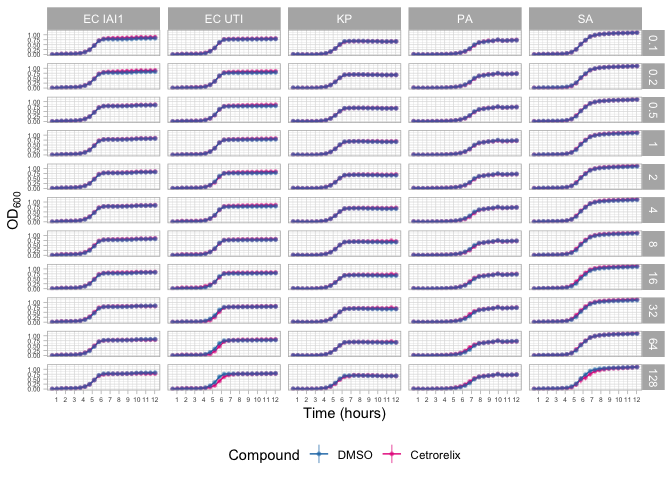<!-- -->

``` r
ggsave(plot=cetro.panel, filename = file.path(OUTPUT_PANEL_PLOTS_DIR, "cetrorelix_panel.pdf"), width = 21, height = 25, units = "cm")
```

### Opicapone

``` r
opica.panel.data <- gather_panel("Opicapone") %>% 
  
  left_join(time_df, by="timepoint") %>% 
  mutate(organism = case_when(organism == "ECiAi" ~ "EC IAI1",
                              organism == "ECUTI" ~ "EC UTI",
                              TRUE ~ organism)) %>% 
  filter(curve_id != "Water")
```

    ## `summarise()` has grouped output by 'compound'. You can override using the
    ## `.groups` argument.
    ## `summarise()` has grouped output by 'compound'. You can override using the
    ## `.groups` argument.
    ## `summarise()` has grouped output by 'compound'. You can override using the
    ## `.groups` argument.
    ## `summarise()` has grouped output by 'compound'. You can override using the
    ## `.groups` argument.
    ## `summarise()` has grouped output by 'compound'. You can override using the
    ## `.groups` argument.
    ## `summarise()` has grouped output by 'compound'. You can override using the
    ## `.groups` argument.
    ## `summarise()` has grouped output by 'compound'. You can override using the
    ## `.groups` argument.
    ## `summarise()` has grouped output by 'compound'. You can override using the
    ## `.groups` argument.
    ## `summarise()` has grouped output by 'compound'. You can override using the
    ## `.groups` argument.
    ## `summarise()` has grouped output by 'compound'. You can override using the
    ## `.groups` argument.
    ## `summarise()` has grouped output by 'compound'. You can override using the
    ## `.groups` argument.
    ## `summarise()` has grouped output by 'compound'. You can override using the
    ## `.groups` argument.
    ## `summarise()` has grouped output by 'compound'. You can override using the
    ## `.groups` argument.
    ## `summarise()` has grouped output by 'compound'. You can override using the
    ## `.groups` argument.
    ## `summarise()` has grouped output by 'compound'. You can override using the
    ## `.groups` argument.
    ## `summarise()` has grouped output by 'compound'. You can override using the
    ## `.groups` argument.
    ## `summarise()` has grouped output by 'compound'. You can override using the
    ## `.groups` argument.
    ## `summarise()` has grouped output by 'compound'. You can override using the
    ## `.groups` argument.
    ## `summarise()` has grouped output by 'compound'. You can override using the
    ## `.groups` argument.
    ## `summarise()` has grouped output by 'compound'. You can override using the
    ## `.groups` argument.
    ## `summarise()` has grouped output by 'compound'. You can override using the
    ## `.groups` argument.
    ## `summarise()` has grouped output by 'compound'. You can override using the
    ## `.groups` argument.
    ## `summarise()` has grouped output by 'compound'. You can override using the
    ## `.groups` argument.
    ## `summarise()` has grouped output by 'compound'. You can override using the
    ## `.groups` argument.
    ## `summarise()` has grouped output by 'compound'. You can override using the
    ## `.groups` argument.
    ## `summarise()` has grouped output by 'compound'. You can override using the
    ## `.groups` argument.
    ## `summarise()` has grouped output by 'compound'. You can override using the
    ## `.groups` argument.
    ## `summarise()` has grouped output by 'compound'. You can override using the
    ## `.groups` argument.
    ## `summarise()` has grouped output by 'compound'. You can override using the
    ## `.groups` argument.
    ## `summarise()` has grouped output by 'compound'. You can override using the
    ## `.groups` argument.
    ## `summarise()` has grouped output by 'compound'. You can override using the
    ## `.groups` argument.
    ## `summarise()` has grouped output by 'compound'. You can override using the
    ## `.groups` argument.
    ## `summarise()` has grouped output by 'compound'. You can override using the
    ## `.groups` argument.
    ## `summarise()` has grouped output by 'compound'. You can override using the
    ## `.groups` argument.
    ## `summarise()` has grouped output by 'compound'. You can override using the
    ## `.groups` argument.
    ## `summarise()` has grouped output by 'compound'. You can override using the
    ## `.groups` argument.
    ## `summarise()` has grouped output by 'compound'. You can override using the
    ## `.groups` argument.
    ## `summarise()` has grouped output by 'compound'. You can override using the
    ## `.groups` argument.
    ## `summarise()` has grouped output by 'compound'. You can override using the
    ## `.groups` argument.
    ## `summarise()` has grouped output by 'compound'. You can override using the
    ## `.groups` argument.
    ## `summarise()` has grouped output by 'compound'. You can override using the
    ## `.groups` argument.
    ## `summarise()` has grouped output by 'compound'. You can override using the
    ## `.groups` argument.
    ## `summarise()` has grouped output by 'compound'. You can override using the
    ## `.groups` argument.
    ## `summarise()` has grouped output by 'compound'. You can override using the
    ## `.groups` argument.
    ## `summarise()` has grouped output by 'compound'. You can override using the
    ## `.groups` argument.
    ## `summarise()` has grouped output by 'compound'. You can override using the
    ## `.groups` argument.
    ## `summarise()` has grouped output by 'compound'. You can override using the
    ## `.groups` argument.
    ## `summarise()` has grouped output by 'compound'. You can override using the
    ## `.groups` argument.
    ## `summarise()` has grouped output by 'compound'. You can override using the
    ## `.groups` argument.
    ## `summarise()` has grouped output by 'compound'. You can override using the
    ## `.groups` argument.
    ## `summarise()` has grouped output by 'compound'. You can override using the
    ## `.groups` argument.
    ## `summarise()` has grouped output by 'compound'. You can override using the
    ## `.groups` argument.
    ## `summarise()` has grouped output by 'compound'. You can override using the
    ## `.groups` argument.
    ## `summarise()` has grouped output by 'compound'. You can override using the
    ## `.groups` argument.
    ## `summarise()` has grouped output by 'compound'. You can override using the
    ## `.groups` argument.

``` r
opica.panel <- ggplot(opica.panel.data, aes(x=time_spent_avg, y=mean_od, ymin = mean_od - stdv, ymax = mean_od + stdv, color=curve_id)) +
  
  geom_line() +
  geom_pointrange(size=0.1, alpha=0.5) +
  
  facet_grid(concentration~organism) +
  
  scale_color_manual(values=c("#1f78b4", "#e7298a"),
                     breaks = c("DMSO", "Opicapone")) +
  
  theme_light() +
  theme(legend.position = "bottom",
        axis.text = element_text(size = 5)) +
  
  scale_x_continuous(breaks = 1:12) +
  
  labs(x="Time (hours)",
       y=latex2exp::TeX("$OD_{600}$"),
       color="Compound")


opica.panel
```

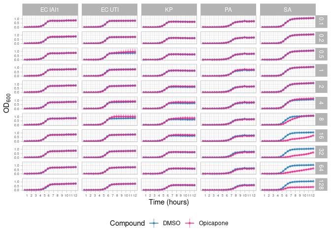<!-- -->

``` r
ggsave(plot=opica.panel, filename = file.path(OUTPUT_PANEL_PLOTS_DIR, "opicapone_panel.pdf"), width = 21, height = 25, units = "cm")
```

### Thymidine

``` r
thym.panel.data <- gather_panel("Thymidine") %>% 
  
  left_join(time_df, by="timepoint") %>% 
  mutate(organism = case_when(organism == "ECiAi" ~ "EC IAI1",
                              organism == "ECUTI" ~ "EC UTI",
                              TRUE ~ organism)) %>% 
  filter(curve_id != "Water")
```

    ## `summarise()` has grouped output by 'compound'. You can override using the
    ## `.groups` argument.
    ## `summarise()` has grouped output by 'compound'. You can override using the
    ## `.groups` argument.
    ## `summarise()` has grouped output by 'compound'. You can override using the
    ## `.groups` argument.
    ## `summarise()` has grouped output by 'compound'. You can override using the
    ## `.groups` argument.
    ## `summarise()` has grouped output by 'compound'. You can override using the
    ## `.groups` argument.
    ## `summarise()` has grouped output by 'compound'. You can override using the
    ## `.groups` argument.
    ## `summarise()` has grouped output by 'compound'. You can override using the
    ## `.groups` argument.
    ## `summarise()` has grouped output by 'compound'. You can override using the
    ## `.groups` argument.
    ## `summarise()` has grouped output by 'compound'. You can override using the
    ## `.groups` argument.
    ## `summarise()` has grouped output by 'compound'. You can override using the
    ## `.groups` argument.
    ## `summarise()` has grouped output by 'compound'. You can override using the
    ## `.groups` argument.
    ## `summarise()` has grouped output by 'compound'. You can override using the
    ## `.groups` argument.
    ## `summarise()` has grouped output by 'compound'. You can override using the
    ## `.groups` argument.
    ## `summarise()` has grouped output by 'compound'. You can override using the
    ## `.groups` argument.
    ## `summarise()` has grouped output by 'compound'. You can override using the
    ## `.groups` argument.
    ## `summarise()` has grouped output by 'compound'. You can override using the
    ## `.groups` argument.
    ## `summarise()` has grouped output by 'compound'. You can override using the
    ## `.groups` argument.
    ## `summarise()` has grouped output by 'compound'. You can override using the
    ## `.groups` argument.
    ## `summarise()` has grouped output by 'compound'. You can override using the
    ## `.groups` argument.
    ## `summarise()` has grouped output by 'compound'. You can override using the
    ## `.groups` argument.
    ## `summarise()` has grouped output by 'compound'. You can override using the
    ## `.groups` argument.
    ## `summarise()` has grouped output by 'compound'. You can override using the
    ## `.groups` argument.
    ## `summarise()` has grouped output by 'compound'. You can override using the
    ## `.groups` argument.
    ## `summarise()` has grouped output by 'compound'. You can override using the
    ## `.groups` argument.
    ## `summarise()` has grouped output by 'compound'. You can override using the
    ## `.groups` argument.
    ## `summarise()` has grouped output by 'compound'. You can override using the
    ## `.groups` argument.
    ## `summarise()` has grouped output by 'compound'. You can override using the
    ## `.groups` argument.
    ## `summarise()` has grouped output by 'compound'. You can override using the
    ## `.groups` argument.
    ## `summarise()` has grouped output by 'compound'. You can override using the
    ## `.groups` argument.
    ## `summarise()` has grouped output by 'compound'. You can override using the
    ## `.groups` argument.
    ## `summarise()` has grouped output by 'compound'. You can override using the
    ## `.groups` argument.
    ## `summarise()` has grouped output by 'compound'. You can override using the
    ## `.groups` argument.
    ## `summarise()` has grouped output by 'compound'. You can override using the
    ## `.groups` argument.
    ## `summarise()` has grouped output by 'compound'. You can override using the
    ## `.groups` argument.
    ## `summarise()` has grouped output by 'compound'. You can override using the
    ## `.groups` argument.
    ## `summarise()` has grouped output by 'compound'. You can override using the
    ## `.groups` argument.
    ## `summarise()` has grouped output by 'compound'. You can override using the
    ## `.groups` argument.
    ## `summarise()` has grouped output by 'compound'. You can override using the
    ## `.groups` argument.
    ## `summarise()` has grouped output by 'compound'. You can override using the
    ## `.groups` argument.
    ## `summarise()` has grouped output by 'compound'. You can override using the
    ## `.groups` argument.
    ## `summarise()` has grouped output by 'compound'. You can override using the
    ## `.groups` argument.
    ## `summarise()` has grouped output by 'compound'. You can override using the
    ## `.groups` argument.
    ## `summarise()` has grouped output by 'compound'. You can override using the
    ## `.groups` argument.
    ## `summarise()` has grouped output by 'compound'. You can override using the
    ## `.groups` argument.
    ## `summarise()` has grouped output by 'compound'. You can override using the
    ## `.groups` argument.
    ## `summarise()` has grouped output by 'compound'. You can override using the
    ## `.groups` argument.
    ## `summarise()` has grouped output by 'compound'. You can override using the
    ## `.groups` argument.
    ## `summarise()` has grouped output by 'compound'. You can override using the
    ## `.groups` argument.
    ## `summarise()` has grouped output by 'compound'. You can override using the
    ## `.groups` argument.
    ## `summarise()` has grouped output by 'compound'. You can override using the
    ## `.groups` argument.
    ## `summarise()` has grouped output by 'compound'. You can override using the
    ## `.groups` argument.
    ## `summarise()` has grouped output by 'compound'. You can override using the
    ## `.groups` argument.
    ## `summarise()` has grouped output by 'compound'. You can override using the
    ## `.groups` argument.
    ## `summarise()` has grouped output by 'compound'. You can override using the
    ## `.groups` argument.
    ## `summarise()` has grouped output by 'compound'. You can override using the
    ## `.groups` argument.

``` r
thym.panel <- ggplot(thym.panel.data, aes(x=time_spent_avg, y=mean_od, ymin = mean_od - stdv, ymax = mean_od + stdv, color=curve_id)) +
  
  geom_line() +
  geom_pointrange(size=0.1, alpha=0.5) +
  
  facet_grid(concentration~organism) +
  
  scale_color_manual(values=c("#1f78b4", "#e7298a"),
                     breaks = c("DMSO", "Thymidine")) +
  
  theme_light() +
  theme(legend.position = "bottom",
        axis.text = element_text(size = 5)) +
  
  scale_x_continuous(breaks = 1:12) +
  
  labs(x="Time (hours)",
       y=latex2exp::TeX("$OD_{600}$"),
       color="Compound")


thym.panel
```

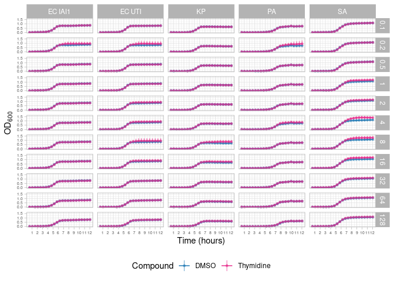<!-- -->

``` r
ggsave(plot=thym.panel, filename = file.path(OUTPUT_PANEL_PLOTS_DIR, "thymidine_panel.pdf"), width = 21, height = 25, units = "cm")
```

## MIC panel.

Here we look at the dose-response data for each compound.

``` r
gather_od <- function(df, t_i){
  
  #' Gather optical density data at a specified timepoint.
  #'
  #' This function gathers optical density data at a specified timepoint for each strain replicate.
  #' It determines the timepoint closest to the specified time of interest for each strain replicate,
  #' then gathers the optical density data corresponding to that timepoint.
  #'
  #' @param df A dataframe containing optical density measurements.
  #' @param t_i Numeric value representing the timepoint of interest.
  #'
  #' @return A dataframe containing optical density data at the specified timepoint.
  #'
  #' @examples
  #' gather_od(df, 6)
  #'
  
  # Determine for each strain_rep the timepoint closest to our time of interest
  tps_interest <- df %>% 
    group_by(strain_rep) %>% 
    
    # Timepoint - timespent relationship
    select(strain_rep, timepoint, time_spent_h) %>% 
    distinct() %>% 
    
    # Gather the timepoint closest to our time of interest
    mutate(diff_time = abs(t_i - time_spent_h)) %>% 
    slice_min(diff_time, n=1) %>% 
    
    select(strain_rep, timepoint) %>% 
    rename("tp_interest" = "timepoint")
  
  
  # Gather relevant OD data
  od_interest <- df %>% 
    left_join(tps_interest, by="strain_rep") %>% 
    
    filter(timepoint == tp_interest)
  
  return(od_interest)
  
  
}

average_od <- function(df){
  
  #' Calculate average optical density measurements per compound per concentration.
  #'
  #' This function calculates the average optical density measurements per compound per concentration.
  #' It creates identifiers for each experiment, calculates the mean, median, and standard deviation of optical density measurements,
  #' separates the experiment information into organism, compound, and concentration columns, and converts concentration to numeric and factor.
  #'
  #' @param df A dataframe containing optical density measurements.
  #'
  #' @return A dataframe containing average optical density measurements per compound per concentration.
  #'
  #' @details This function requires the tidyverse package to be installed and loaded in the R environment.
  #'
  #' @examples
  #' average_od(df)
      
  # Get the average OD per compound per concentration
  od_avergaes_dose <- df %>% 
    
    # Create identifiers
    mutate(experiment_info = paste(organism, compound, concentration, sep = "_")) %>% 
    
    # Gather mean per experiment
    group_by(experiment_info) %>% 
    summarise(n_samples = n(), avg_od = mean(od), med_od = median(od), stdv = sd(od)) %>% 
    ungroup() %>% 
    
    # Un group
    separate(experiment_info, into=c("organism", "compound", "concentration"), sep="_") %>% 
    mutate(concentration = as.numeric(concentration),
           concentration = factor(concentration, levels=sort(unique(concentration))))
  
  return(od_avergaes_dose)
  
}

dose_growth <- function(od_at_h, all_info=complete_od, 
                        exclude_water = TRUE){
  
  #' Calculate dose-response growth curves based on optical density measurements.
  #'
  #' This function calculates dose-response growth curves based on optical density measurements at a specific timepoint.
  #' It first creates a column containing the strain replicate information, gathers optical density at the specified timepoint,
  #' calculates the average response for each compound at the specified timepoint, excludes water data if specified, and reorders compounds for plotting.
  #'
  #' @param od_at_h Numeric value representing optical density at the timepoint of interest.
  #' @param all_info A dataframe containing all optical density measurements. Defaults to complete_od.
  #' @param exclude_water Logical indicating whether to exclude water data from the analysis. Defaults to TRUE.
  #'
  #' @return A dataframe containing dose-response growth curves based on optical density measurements.
  #'
  #' @examples
  #' dose_growth(0.5, complete_od)
  
  # Create a column that contains the strain replicate
  info_strainrep <- all_info %>% 
    mutate(strain_rep = paste(organism, replicate, sep="_"))
  
  # Gather od at the time of interest
  od_interest <- gather_od(info_strainrep, od_at_h)
  
  # Gather the average response at tp
  od_averages <- average_od(od_interest)
  
  
  # Exclude water
  if(exclude_water){
    od_averages <- od_averages %>% 
      filter(compound != "Water")
  }
  
  # Re-oder compounds
  chemicals <- unique(od_averages$compound)
  chemicals_wo_dmso <- sort(chemicals[chemicals!="DMSO"])
  chemical_levels <- c("DMSO", chemicals_wo_dmso)
  
  od_averages <- od_averages %>% 
    mutate(compound = factor(compound, levels=chemical_levels),
           od_at_t = od_at_h)
  
  
  
  return(od_averages)
}
```

### OD after 10 hours of growth.

``` r
dose_response_10 <-  dose_growth(10)

dose_reponse_10.p <- ggplot(dose_response_10, aes(x=concentration, y=avg_od, 
                             ymin=avg_od - stdv, ymax=avg_od + stdv,
                             group=organism, color=organism)) +
  
  geom_line() +
  geom_pointrange(size=0.35, alpha=0.5) +
  
  scale_color_manual(values=c("#1b9e77", "#d95f02", "#7570b3", "#e6ab02", "#e7298a"),
                     
                     labels=c(expression(paste(italic("E. coli "), "IAI1")), 
                              expression(paste(italic("E. coli "), "UTI")), 
                              expression(italic("K. pneumoniae")), 
                              expression(italic("P. aeruginosa")), 
                              expression(italic("S. aureus")))) +
  
  facet_wrap(~compound, ncol=4, scales="free_x") +
  
  theme_bw() +
  theme(legend.position = "right",
        legend.text.align = 0,
        text = element_text(size=10)) +
  
  labs(x=latex2exp::TeX("Concentration ($\\mu$g/mL)"),
       color="Organism",
       y=latex2exp::TeX("$OD_{600}$ after 10 hours"))

dose_reponse_10.p
```

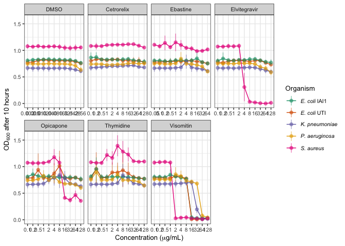<!-- -->

## Specific growth curves.

Here we look at specific growth curves.

### Ebastine.

Ebastine effects on the growth of *S. aureus*.

``` r
# Gather the relevant data
ebas_od <- complete_od %>% 
  filter(organism == "SA", 
         compound %in% c("Ebastine", "DMSO", "Water"),
         timepoint >= 2) %>% 
  
  mutate(chem_conc = paste(compound, concentration, sep="_")) %>% 
  filter(chem_conc %in% c("Ebastine_16", "Ebastine_32", "DMSO_0.64", "Water_0"),
         str_detect(well, "^[HGD]"))


sa_ebastine_od <- ggplot() +
  geom_line(data=subset(ebas_od, chem_conc == "Water_0"), aes(x=time_spent_h, y=od, group=curve_id, color=chem_conc), linewidth=0.45) +
  geom_line(data=subset(ebas_od, chem_conc == "DMSO_0.64"), aes(x=time_spent_h, y=od, group=curve_id, color=chem_conc), linewidth=1) +
  geom_line(data=subset(ebas_od, chem_conc == "Ebastine_16"), aes(x=time_spent_h, y=od, group=curve_id, color=chem_conc), linewidth=1) +
  #geom_line(data=subset(ebas_od, chem_conc == "Ebastine_32"), aes(x=time_spent_h, y=od, group=curve_id, color=chem_conc), linewidth=1) +
  
  scale_color_manual(values=c("grey", "#1f78b4", "#e7298a"),
                     labels=c("Water", latex2exp::TeX("DMSO (0.64 $\\mu$g/mL)"), latex2exp::TeX("Ebastine (16 $\\mu$g/mL)")), #, latex2exp::TeX("Ebastine (32 $\\mu$g/mL)")),
                     breaks = c("Water_0", "DMSO_0.64", "Ebastine_16")) + #, "Ebastine_32")) +
  
  scale_x_continuous(breaks = 1:12) +
  theme_bw() +
  labs(title = expression(paste(italic("S. aureus "), "- Ebastine")),
       x="Time (hours)", 
       y=latex2exp::TeX("$OD_{600}$"),
       color="Compound") +
  
  theme(text = element_text(size=10))

sa_ebastine_od
```

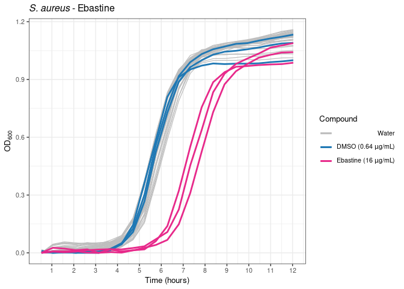<!-- -->

### Opicapone.

Opicapone effects on the growth of *S. aureus*.

``` r
opi_od <- complete_od %>% 
  filter(organism == "SA", 
         compound %in% c("Opicapone", "DMSO", "Water"),
         timepoint >= 2) %>% 
  
  mutate(chem_conc = paste(compound, concentration, sep="_")) %>% 
  filter(chem_conc %in% c("Opicapone_16", "Opicapone_128", "DMSO_2.56", "Water_0"),
         str_detect(well, "^[HGB]")) 


sa_opicapone_od <- ggplot() +
  geom_line(data=subset(opi_od, chem_conc == "Water_0"), aes(x=time_spent_h, y=od, group=curve_id, color=chem_conc), linewidth=0.45) +
  geom_line(data=subset(opi_od, chem_conc == "DMSO_2.56"), aes(x=time_spent_h, y=od, group=curve_id, color=chem_conc), linewidth=1) +
  geom_line(data=subset(opi_od, chem_conc == "Opicapone_16"), aes(x=time_spent_h, y=od, group=curve_id, color=chem_conc), linewidth=1) +
  geom_line(data=subset(opi_od, chem_conc == "Opicapone_128"), aes(x=time_spent_h, y=od, group=curve_id, color=chem_conc), linewidth=1) +
  
  scale_color_manual(values=c("grey", "#1f78b4", "#fbb4b9", "#ae017e"),
                     labels=c("Water", latex2exp::TeX("DMSO (2.56 $\\mu$g/mL)"), latex2exp::TeX("Opicapone (16 $\\mu$g/mL)"), latex2exp::TeX("Opicapone (128 $\\mu$g/mL)")),
                     breaks = c("Water_0", "DMSO_2.56", "Opicapone_16", "Opicapone_128")) +
  
  scale_x_continuous(breaks = 1:12) + 
  
  theme_bw() +
  labs(title = expression(paste(italic("S. aureus "), "- Opicapone")),
       x="Time (hours)", 
       y=latex2exp::TeX("$OD_{600}$"),
       color="Compound") +
  theme(text = element_text(size=10),
        legend.position = c(0.19, 0.77))

sa_opicapone_od
```

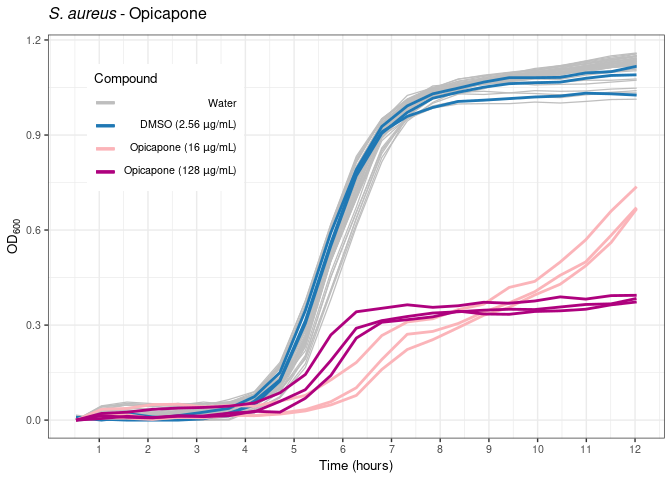<!-- -->

### Cetrorelix

Ebastine effects on the growth of *S. aureus*.

``` r
# Gather the relevant data
cetro_od <- complete_od %>% 
  filter(organism == "SA", 
         compound %in% c("Cetrorelix", "DMSO", "Water"),
         timepoint >= 2) %>% 
  
  mutate(chem_conc = paste(compound, concentration, sep="_")) %>% 
  filter(chem_conc %in% c("Cetrorelix_128", "DMSO_2.56", "Water_0"),
         str_detect(well, "^[HGA]"))


sa_cetrorelix_od <- ggplot() +
  geom_line(data=subset(cetro_od, chem_conc == "Water_0"), aes(x=time_spent_h, y=od, group=curve_id, color=chem_conc), linewidth=0.45) +
  geom_line(data=subset(cetro_od, chem_conc == "DMSO_2.56"), aes(x=time_spent_h, y=od, group=curve_id, color=chem_conc), linewidth=1) +
  geom_line(data=subset(cetro_od, chem_conc == "Cetrorelix_128"), aes(x=time_spent_h, y=od, group=curve_id, color=chem_conc), linewidth=1) +
  
  scale_color_manual(values=c("grey", "#1f78b4", "#e7298a"),
                     labels=c("Water", latex2exp::TeX("DMSO (2.56 $\\mu$g/mL)"), latex2exp::TeX("Cetrorelix (128 $\\mu$g/mL)")),
                     breaks = c("Water_0", "DMSO_2.56", "Cetrorelix_128")) +
  
  scale_x_continuous(breaks = 1:12) +
  theme_bw() +
  labs(title = expression(paste(italic("S. aureus "), "- Cetrorelix")),
       x="Time (hours)", 
       y=latex2exp::TeX("$OD_{600}$"),
       color="Compound") +
  
  theme(text = element_text(size=10))

sa_cetrorelix_od
```

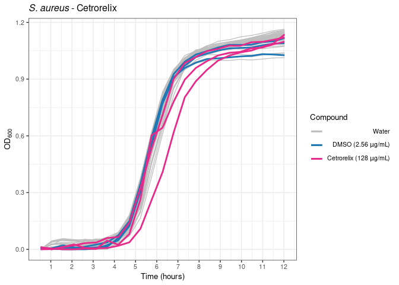<!-- -->

## Sigmoid Modelling.

``` r
library(sicegar)
```

``` r
# Function to check growth
checkGrowth <- function(growth_df, threshold=0.2, n_above_threshold=2){
  
  
  # Check if at least n_above_threshold timepoints pass the OD threshold
  maxOD_check <- sum(growth_df$intensity > threshold) >= n_above_threshold
  
  return(maxOD_check)
  
}

# Function to calculate the fitted curve
logistic_parametrized <- function(x, Imax, xmid, alpha){
  
  y <- Imax / (1 + exp(-alpha*(x-xmid)))
  return(y)
}


# Global sigmoid fitting function 

fit_sigmoids <- function(cid, data_df, base_output=NULL, minimum_od = 0.2, n_above_minOD=2){
  
  #' This function performs growth check, normalisation, sigmoid fitting and parameter estimation for a given growth curve.
  #' @param curve_id some identifier that allows for the selection of an individual curve form data_df
  #' @param data_df Data.Frame that contains all of the growth information
  #' @param base_output data.frame that acts as placeholder for unsuccessful growth curve fits
  #' @param minimum_od value that indicates the OD threshold that must be surpassed by a growth in order to be considered "alive"
  #' @param n_above_minOD value that indicates the number of timepoints where the OD value is greater than minimum_od
  
  #' @return data.frame contains information on whether the curve passed the growth pre-check and, if so, the parameters of the estimated logistic curve.
  
  
  # Get the relevant data
  curve_od <- data_df %>% 
    filter(curve_id == cid) %>% 
    select(time_spent_h, od) %>% 
    rename("time" = "time_spent_h", "intensity" = "od")
  
  
  # Check if the curve is growing
  precheck <- checkGrowth(growth_df = curve_od, threshold = minimum_od, n_above_threshold = n_above_minOD)
  
  # Output if the check fails
  if (precheck == FALSE){
    
    out_df <- base_output
    out_df$dataInputName <- cid
    out_df$isThisaFit <- FALSE
    out_df$model <- "no_model"
    out_df$additionalParameters <- FALSE
    out_df$maximum_x <- NA
    
    return(out_df)
    }
  
  # If there is a signal, fit the data

  
  # Normalise the data
  curve_od.norm <- sicegar::normalizeData(dataInput = curve_od, dataInputName = cid)
  
  
  # Perform modelling
  set.seed(42)
  sigmoidalModel <- multipleFitFunction(dataInput=curve_od.norm,
                                      model="sigmoidal")
  
  # Additional Parameters
  fit_vector <- parameterCalculation(sigmoidalModel)
  
  # Format as datafrane
  out_df <- data.frame(fit_vector)
  
  return(out_df)
  
}


example_out <- fit_sigmoids(cid = "ECiAi_F1_1", data_df = complete_od)

for(c in colnames(example_out)){
  example_out[, c] <- 0
}
```

Apply sigmoid function to all curves.

``` r
library(foreach) # Parallelization
```

    ## 
    ## Attaching package: 'foreach'

    ## The following objects are masked from 'package:purrr':
    ## 
    ##     accumulate, when

``` r
doParallel::registerDoParallel(cores=10)

fit.curves <- foreach(cid = unique(complete_od$curve_id), .combine = "rbind") %dopar% fit_sigmoids(cid, complete_od, example_out)
```

Add generation time.

``` r
growth.params <- fit.curves %>% 
  
  # Relevant growth parameters
  select(dataInputName, startPoint_x, reachMaximum_x, maximum_y, midPoint_x, slopeParam_Estimate) %>% 
  separate(dataInputName, into = c("organism", "well", "replicate"), sep="_", remove = FALSE) %>% 
  
  # Add generation time
  mutate(generation_time = log(2) / slopeParam_Estimate,
         generation_time = if_else(generation_time == Inf, 0, generation_time)) %>% 
  
  # Add metadata
  left_join(well_metadata, by="well")
```

## Compare growth parameters

``` r
GPARAM_OUTPUT_DIR <- file.path(OUTPUT_DIR, "growth_parameter_plots")

if(!dir.exists(GPARAM_OUTPUT_DIR)){
  
  dir.create(GPARAM_OUTPUT_DIR)
  
}
```

``` r
# Gather the growth parameters
gather_gparam <- function(compound_name, gparam_df = growth.params, meta_df = well_metadata){
  
  #' Gather growth parameters for a specific compound.
  #'
  #' This function gathers growth parameters for a specific compound from a growth parameter dataframe.
  #' The resulting dataframe includes parameters for the specified compound, DMSO, and water.
  #'
  #' @param compound_name A character specifying the name of the compound for which parameters are to be gathered.
  #' @param gparam_df A dataframe containing growth parameters. Defaults to growth.params.
  #' @param meta_df A dataframe containing metadata information about wells. Defaults to well_metadata.
  #'
  #' @return A dataframe containing growth parameters for the specified compound, DMSO, and water.
  #'
  #' @examples
  #' gather_gparam("compound_name", growth.params, well_metadata)

  
  # Gather compound parameters
  compound.parameters <- gparam_df %>% 
    filter(compound == compound_name) %>% 
    
    # Add column for chemical concentration
    mutate(chem_conc = concentration)
  
 # Gather the corresponding DMSO percentage
  conc.map <- compound.parameters %>% 
    select(concentration, dmso_percentage) %>% 
    distinct() %>% 
    rename("chem_conc" = "concentration")
  
  # If DMSO == 0 add the common concentration range
  if(all(conc.map$dmso_percentage == 0)){
    
    conc.map <- gparam_df %>% 
      filter(compound == "Opicapone") %>% 
      
      select(concentration, dmso_percentage) %>% 
      distinct() %>% 
      rename("chem_conc" = "concentration")
    
  }
  
  # Gather the DMSO well
  dmso.params <- gparam_df %>% 
    filter(compound %in% c("DMSO")) %>% 
    left_join(conc.map, by="dmso_percentage") %>% 
    filter(!is.na(chem_conc))
  
  
  # Add water parameters
  water_params <- gparam_df %>% 
     filter(compound %in% c("Water"), str_detect(well, "^H"))
  
  complete_water <- bind_rows(lapply(unique(compound.parameters$chem_conc), function(x){water_params$chem_conc = x; water_params}))
  
  # Combine all data
  complete_params <- bind_rows(complete_water, dmso.params, compound.parameters) %>% 
    mutate(compound = factor(compound, levels = c("Water", "DMSO", compound_name)))
  
  return(complete_params)
}
```

### Visomitin.

``` r
# Specify compound 
compound_n <- "Visomitin"

# Gather the parameters
compound.params <- gather_gparam(compound_n)


# Maximum OD plot
maxod.bp <- ggplot(compound.params, aes(x=compound, y=maximum_y, fill=compound)) +
  geom_boxplot(width=0.8) +
  geom_point(fill="black") +
  
  facet_grid(chem_conc~organism) +
  theme_light() +
  theme(legend.position = "none",
        text = element_text(size=10),
        axis.text.x = element_text(angle = 45, hjust = 1, vjust = 1.25)) +
  labs(x="",
       title = paste(compound_n, "- Maximum OD"))


# End of Lag Phase
lagphase.bp <- ggplot(compound.params, aes(x=compound, y=startPoint_x, fill=compound)) +
  geom_boxplot(width=0.8) +
  geom_point(fill="black") +
  
  facet_grid(chem_conc~organism) +
  theme_light() +
  theme(legend.position = "none",
        text = element_text(size=10),
        axis.text.x = element_text(angle = 45, hjust = 1, vjust = 1.25)) +
  labs(x="",
       title = paste(compound_n, "- End of Lag Phase"))


# Start Stationary
statphase.bp <- ggplot(compound.params, aes(x=compound, y=reachMaximum_x, fill=compound)) +
  geom_boxplot(width=0.8) +
  geom_point(fill="black") +
  
  facet_grid(chem_conc~organism) +
  theme_light() +
  theme(legend.position = "none",
        text = element_text(size=10),
        axis.text.x = element_text(angle = 45, hjust = 1, vjust = 1.25)) +
  labs(x="",
       title = paste(compound_n, "- Start Stationary Phase"))

# Generation Time
gentime.bp <- ggplot(compound.params, aes(x=compound, y=generation_time, fill=compound)) +
  geom_boxplot(width=0.8) +
  geom_point(fill="black") +
  
  facet_grid(chem_conc~organism) +
  theme_light() +
  theme(legend.position = "none",
        text = element_text(size=10),
        axis.text.x = element_text(angle = 45, hjust = 1, vjust = 1.25)) +
  labs(x="",
       title = paste(compound_n, "- Generation Time"))

ggsave(plot=maxod.bp, filename = file.path(GPARAM_OUTPUT_DIR, paste0(compound_n, "_maxOD.pdf")), width = 21, height = 25, units = "cm")
ggsave(plot=lagphase.bp, filename = file.path(GPARAM_OUTPUT_DIR, paste0(compound_n, "_lagPhase.pdf")), width = 21, height = 25, units = "cm")
ggsave(plot=statphase.bp, filename = file.path(GPARAM_OUTPUT_DIR, paste0(compound_n, "_stationaryPhase.pdf")), width = 21, height = 25, units = "cm")
ggsave(plot=gentime.bp, filename = file.path(GPARAM_OUTPUT_DIR, paste0(compound_n, "_genTime.pdf")), width = 21, height = 25, units = "cm")
```

### Elvitegravir

``` r
# Specify compound 
compound_n <- "Elvitegravir"

# Gather the parameters
compound.params <- gather_gparam(compound_n)


# Maximum OD plot
maxod.bp <- ggplot(compound.params, aes(x=compound, y=maximum_y, fill=compound)) +
  geom_boxplot(width=0.8) +
  geom_point(fill="black") +
  
  facet_grid(chem_conc~organism) +
  theme_light() +
  theme(legend.position = "none",
        text = element_text(size=10),
        axis.text.x = element_text(angle = 45, hjust = 1, vjust = 1.25)) +
  labs(x="",
       title = paste(compound_n, "- Maximum OD"))


# End of Lag Phase
lagphase.bp <- ggplot(compound.params, aes(x=compound, y=startPoint_x, fill=compound)) +
  geom_boxplot(width=0.8) +
  geom_point(fill="black") +
  
  facet_grid(chem_conc~organism) +
  theme_light() +
  theme(legend.position = "none",
        text = element_text(size=10),
        axis.text.x = element_text(angle = 45, hjust = 1, vjust = 1.25)) +
  labs(x="",
       title = paste(compound_n, "- End of Lag Phase"))


# Start Stationary
statphase.bp <- ggplot(compound.params, aes(x=compound, y=reachMaximum_x, fill=compound)) +
  geom_boxplot(width=0.8) +
  geom_point(fill="black") +
  
  facet_grid(chem_conc~organism) +
  theme_light() +
  theme(legend.position = "none",
        text = element_text(size=10),
        axis.text.x = element_text(angle = 45, hjust = 1, vjust = 1.25)) +
  labs(x="",
       title = paste(compound_n, "- Start Stationary Phase"))

# Generation Time
gentime.bp <- ggplot(compound.params, aes(x=compound, y=generation_time, fill=compound)) +
  geom_boxplot(width=0.8) +
  geom_point(fill="black") +
  
  facet_grid(chem_conc~organism) +
  theme_light() +
  theme(legend.position = "none",
        text = element_text(size=10),
        axis.text.x = element_text(angle = 45, hjust = 1, vjust = 1.25)) +
  labs(x="",
       title = paste(compound_n, "- Generation Time"))

ggsave(plot=maxod.bp, filename = file.path(GPARAM_OUTPUT_DIR, paste0(compound_n, "_maxOD.pdf")), width = 21, height = 25, units = "cm")
ggsave(plot=lagphase.bp, filename = file.path(GPARAM_OUTPUT_DIR, paste0(compound_n, "_lagPhase.pdf")), width = 21, height = 25, units = "cm")
ggsave(plot=statphase.bp, filename = file.path(GPARAM_OUTPUT_DIR, paste0(compound_n, "_stationaryPhase.pdf")), width = 21, height = 25, units = "cm")
ggsave(plot=gentime.bp, filename = file.path(GPARAM_OUTPUT_DIR, paste0(compound_n, "_genTime.pdf")), width = 21, height = 25, units = "cm")
```

### Ebastine

``` r
# Specify compound 
compound_n <- "Ebastine"

# Gather the parameters
compound.params <- gather_gparam(compound_n)


# Maximum OD plot
maxod.bp <- ggplot(compound.params, aes(x=compound, y=maximum_y, fill=compound)) +
  geom_boxplot(width=0.8) +
  geom_point(fill="black") +
  
  facet_grid(chem_conc~organism) +
  theme_light() +
  theme(legend.position = "none",
        text = element_text(size=10),
        axis.text.x = element_text(angle = 45, hjust = 1, vjust = 1.25)) +
  labs(x="",
       title = paste(compound_n, "- Maximum OD"))


# End of Lag Phase
lagphase.bp <- ggplot(compound.params, aes(x=compound, y=startPoint_x, fill=compound)) +
  geom_boxplot(width=0.8) +
  geom_point(fill="black") +
  
  facet_grid(chem_conc~organism) +
  theme_light() +
  theme(legend.position = "none",
        text = element_text(size=10),
        axis.text.x = element_text(angle = 45, hjust = 1, vjust = 1.25)) +
  labs(x="",
       title = paste(compound_n, "- End of Lag Phase"))


# Start Stationary
statphase.bp <- ggplot(compound.params, aes(x=compound, y=reachMaximum_x, fill=compound)) +
  geom_boxplot(width=0.8) +
  geom_point(fill="black") +
  
  facet_grid(chem_conc~organism) +
  theme_light() +
  theme(legend.position = "none",
        text = element_text(size=10),
        axis.text.x = element_text(angle = 45, hjust = 1, vjust = 1.25)) +
  labs(x="",
       title = paste(compound_n, "- Start Stationary Phase"))

# Generation Time
gentime.bp <- ggplot(compound.params, aes(x=compound, y=generation_time, fill=compound)) +
  geom_boxplot(width=0.8) +
  geom_point(fill="black") +
  
  facet_grid(chem_conc~organism) +
  theme_light() +
  theme(legend.position = "none",
        text = element_text(size=10),
        axis.text.x = element_text(angle = 45, hjust = 1, vjust = 1.25)) +
  labs(x="",
       title = paste(compound_n, "- Generation Time"))

ggsave(plot=maxod.bp, filename = file.path(GPARAM_OUTPUT_DIR, paste0(compound_n, "_maxOD.pdf")), width = 21, height = 25, units = "cm")
ggsave(plot=lagphase.bp, filename = file.path(GPARAM_OUTPUT_DIR, paste0(compound_n, "_lagPhase.pdf")), width = 21, height = 25, units = "cm")
ggsave(plot=statphase.bp, filename = file.path(GPARAM_OUTPUT_DIR, paste0(compound_n, "_stationaryPhase.pdf")), width = 21, height = 25, units = "cm")
ggsave(plot=gentime.bp, filename = file.path(GPARAM_OUTPUT_DIR, paste0(compound_n, "_genTime.pdf")), width = 21, height = 25, units = "cm")
```

``` r
compound.params %>% 
  filter(organism == "SA", 
         chem_conc == "16") %>% 
  
  ggplot(aes(x=compound, y=startPoint_x, fill=compound)) +
    geom_boxplot(width=0.8) +
    geom_point(fill="black") +
    
    theme_light() +
    theme(legend.position = "none") +
    labs(x="",
         title = paste(compound_n, "- End of Lag Phase - S. aureus"))
```

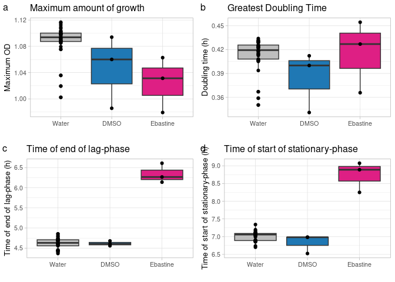<!-- -->

We can look at the average increase in the start of the growth

``` r
compound.params %>% 
  filter(organism == "SA", 
         chem_conc == "16") %>% 
  
  group_by(compound) %>% 
  summarise(average_lp = mean(startPoint_x), stdv_lp = sd(startPoint_x)) %>% 
  knitr::kable()
```

| compound | average_lp |   stdv_lp |
|:---------|-----------:|----------:|
| Water    |   4.622365 | 0.1355105 |
| DMSO     |   4.613593 | 0.0609431 |
| Ebastine |   6.337734 | 0.2433150 |

``` r
paste("Delay of onset of growth by", 6.337735 - 4.613593, "hours")
```

    ## [1] "Delay of onset of growth by 1.724142 hours"

### Opicapone

``` r
# Specify compound 
compound_n <- "Opicapone"

# Gather the parameters
compound.params <- gather_gparam(compound_n)


# Maximum OD plot
maxod.bp <- ggplot(compound.params, aes(x=compound, y=maximum_y, fill=compound)) +
  geom_boxplot(width=0.8) +
  geom_point(fill="black") +
  
  facet_grid(chem_conc~organism) +
  theme_light() +
  theme(legend.position = "none",
        text = element_text(size=10),
        axis.text.x = element_text(angle = 45, hjust = 1, vjust = 1.25)) +
  labs(x="",
       title = paste(compound_n, "- Maximum OD"))


# End of Lag Phase
lagphase.bp <- ggplot(compound.params, aes(x=compound, y=startPoint_x, fill=compound)) +
  geom_boxplot(width=0.8) +
  geom_point(fill="black") +
  
  facet_grid(chem_conc~organism) +
  theme_light() +
  theme(legend.position = "none",
        text = element_text(size=10),
        axis.text.x = element_text(angle = 45, hjust = 1, vjust = 1.25)) +
  labs(x="",
       title = paste(compound_n, "- End of Lag Phase"))


# Start Stationary
statphase.bp <- ggplot(compound.params, aes(x=compound, y=reachMaximum_x, fill=compound)) +
  geom_boxplot(width=0.8) +
  geom_point(fill="black") +
  
  facet_grid(chem_conc~organism) +
  theme_light() +
  theme(legend.position = "none",
        text = element_text(size=10),
        axis.text.x = element_text(angle = 45, hjust = 1, vjust = 1.25)) +
  labs(x="",
       title = paste(compound_n, "- Start Stationary Phase"))

# Generation Time
gentime.bp <- ggplot(compound.params, aes(x=compound, y=generation_time, fill=compound)) +
  geom_boxplot(width=0.8) +
  geom_point(fill="black") +
  
  facet_grid(chem_conc~organism) +
  theme_light() +
  theme(legend.position = "none",
        text = element_text(size=10),
        axis.text.x = element_text(angle = 45, hjust = 1, vjust = 1.25)) +
  labs(x="",
       title = paste(compound_n, "- Generation Time"))

ggsave(plot=maxod.bp, filename = file.path(GPARAM_OUTPUT_DIR, paste0(compound_n, "_maxOD.pdf")), width = 21, height = 25, units = "cm")
ggsave(plot=lagphase.bp, filename = file.path(GPARAM_OUTPUT_DIR, paste0(compound_n, "_lagPhase.pdf")), width = 21, height = 25, units = "cm")
ggsave(plot=statphase.bp, filename = file.path(GPARAM_OUTPUT_DIR, paste0(compound_n, "_stationaryPhase.pdf")), width = 21, height = 25, units = "cm")
ggsave(plot=gentime.bp, filename = file.path(GPARAM_OUTPUT_DIR, paste0(compound_n, "_genTime.pdf")), width = 21, height = 25, units = "cm")
```

``` r
compound.params %>% 
  filter(organism == "SA", 
         chem_conc == "16") %>% 
  
  ggplot(aes(x=compound, y=startPoint_x, fill=compound)) +
    geom_boxplot(width=0.8) +
    geom_point(fill="black") +
    
    theme_light() +
    theme(legend.position = "none") +
    labs(x="",
         title = paste(compound_n, "- End of Lag Phase - S. aureus"))
```

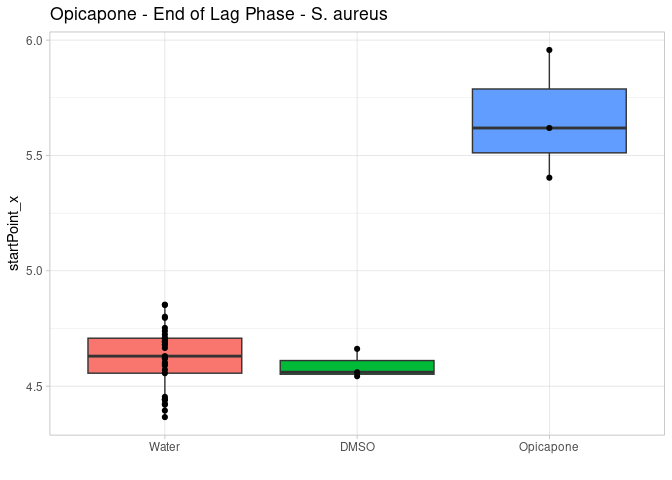<!-- -->

``` r
compound.params %>% 
  filter(organism == "SA", 
         chem_conc == "16") %>% 
  
  group_by(compound) %>% 
  summarise(average_lp = mean(startPoint_x), stdv_lp = sd(startPoint_x)) %>% 
  knitr::kable()
```

| compound  | average_lp |   stdv_lp |
|:----------|-----------:|----------:|
| Water     |   4.622365 | 0.1355105 |
| DMSO      |   4.588387 | 0.0641173 |
| Opicapone |   5.659881 | 0.2791082 |

``` r
paste("Delay of onset of growth by", 5.659881 - 4.588387, "hours")
```

    ## [1] "Delay of onset of growth by 1.071494 hours"

``` r
compound.params %>% 
  filter(organism == "SA", 
         chem_conc == "16") %>% 
  
  ggplot(aes(x=compound, y=generation_time, fill=compound)) +
    geom_boxplot(width=0.8) +
    geom_point(fill="black") +
    
    theme_light() +
    theme(legend.position = "none") +
    labs(x="",
         title = paste(compound_n, "- Doubling Time - S. aureus"))
```

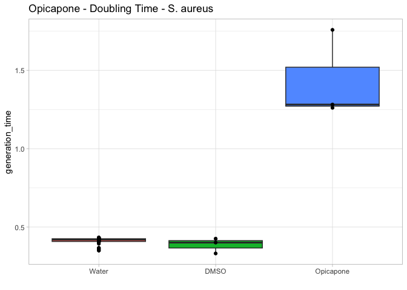<!-- -->

``` r
compound.params %>% 
  filter(organism == "SA", 
         chem_conc == "16") %>% 
  
  group_by(compound) %>% 
  summarise(average_gt = mean(generation_time), stdv_gt = sd(generation_time)) %>% 
  knitr::kable()
```

| compound  | average_gt |   stdv_gt |
|:----------|-----------:|----------:|
| Water     |  0.4141490 | 0.0202054 |
| DMSO      |  0.3863526 | 0.0488593 |
| Opicapone |  1.4331948 | 0.2811447 |

### Cetrorelix

``` r
# Specify compound 
compound_n <- "Cetrorelix"

# Gather the parameters
compound.params <- gather_gparam(compound_n)


# Maximum OD plot
maxod.bp <- ggplot(compound.params, aes(x=compound, y=maximum_y, fill=compound)) +
  geom_boxplot(width=0.8) +
  geom_point(fill="black") +
  
  facet_grid(chem_conc~organism) +
  theme_light() +
  theme(legend.position = "none",
        text = element_text(size=10),
        axis.text.x = element_text(angle = 45, hjust = 1, vjust = 1.25)) +
  labs(x="",
       title = paste(compound_n, "- Maximum OD"))


# End of Lag Phase
lagphase.bp <- ggplot(compound.params, aes(x=compound, y=startPoint_x, fill=compound)) +
  geom_boxplot(width=0.8) +
  geom_point(fill="black") +
  
  facet_grid(chem_conc~organism) +
  theme_light() +
  theme(legend.position = "none",
        text = element_text(size=10),
        axis.text.x = element_text(angle = 45, hjust = 1, vjust = 1.25)) +
  labs(x="",
       title = paste(compound_n, "- End of Lag Phase"))


# Start Stationary
statphase.bp <- ggplot(compound.params, aes(x=compound, y=reachMaximum_x, fill=compound)) +
  geom_boxplot(width=0.8) +
  geom_point(fill="black") +
  
  facet_grid(chem_conc~organism) +
  theme_light() +
  theme(legend.position = "none",
        text = element_text(size=10),
        axis.text.x = element_text(angle = 45, hjust = 1, vjust = 1.25)) +
  labs(x="",
       title = paste(compound_n, "- Start Stationary Phase"))

# Generation Time
gentime.bp <- ggplot(compound.params, aes(x=compound, y=generation_time, fill=compound)) +
  geom_boxplot(width=0.8) +
  geom_point(fill="black") +
  
  facet_grid(chem_conc~organism) +
  theme_light() +
  theme(legend.position = "none",
        text = element_text(size=10),
        axis.text.x = element_text(angle = 45, hjust = 1, vjust = 1.25)) +
  labs(x="",
       title = paste(compound_n, "- Generation Time"))

ggsave(plot=maxod.bp, filename = file.path(GPARAM_OUTPUT_DIR, paste0(compound_n, "_maxOD.pdf")), width = 21, height = 25, units = "cm")
ggsave(plot=lagphase.bp, filename = file.path(GPARAM_OUTPUT_DIR, paste0(compound_n, "_lagPhase.pdf")), width = 21, height = 25, units = "cm")
ggsave(plot=statphase.bp, filename = file.path(GPARAM_OUTPUT_DIR, paste0(compound_n, "_stationaryPhase.pdf")), width = 21, height = 25, units = "cm")
ggsave(plot=gentime.bp, filename = file.path(GPARAM_OUTPUT_DIR, paste0(compound_n, "_genTime.pdf")), width = 21, height = 25, units = "cm")
```

``` r
compound.params %>% 
  filter(organism == "SA", 
         chem_conc == "128") %>% 
  
  ggplot(aes(x=compound, y=generation_time, fill=compound)) +
    geom_boxplot(width=0.8) +
    geom_point(fill="black") +
    
    theme_light() +
    theme(legend.position = "none") +
    labs(x="",
         title = paste(compound_n, "- Doubling Time - S. aureus"))
```

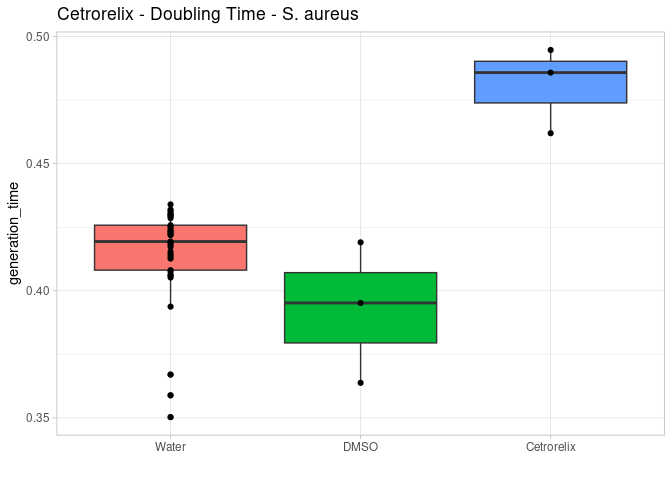<!-- -->

``` r
compound.params %>% 
  filter(organism == "SA", 
         chem_conc == "128") %>% 
  
  group_by(compound) %>% 
  summarise(average_gt = mean(generation_time), stdv_gt = sd(generation_time)) %>% 
  knitr::kable()
```

| compound   | average_gt |   stdv_gt |
|:-----------|-----------:|----------:|
| Water      |  0.4141490 | 0.0202054 |
| DMSO       |  0.3926798 | 0.0277075 |
| Cetrorelix |  0.4807707 | 0.0169240 |

### Thymidine

``` r
# Specify compound 
compound_n <- "Thymidine"

# Gather the parameters
compound.params <- gather_gparam(compound_n)


# Maximum OD plot
maxod.bp <- ggplot(compound.params, aes(x=compound, y=maximum_y, fill=compound)) +
  geom_boxplot(width=0.8) +
  geom_point(fill="black") +
  
  facet_grid(chem_conc~organism) +
  theme_light() +
  theme(legend.position = "none",
        text = element_text(size=10),
        axis.text.x = element_text(angle = 45, hjust = 1, vjust = 1.25)) +
  labs(x="",
       title = paste(compound_n, "- Maximum OD"))


# End of Lag Phase
lagphase.bp <- ggplot(compound.params, aes(x=compound, y=startPoint_x, fill=compound)) +
  geom_boxplot(width=0.8) +
  geom_point(fill="black") +
  
  facet_grid(chem_conc~organism) +
  theme_light() +
  theme(legend.position = "none",
        text = element_text(size=10),
        axis.text.x = element_text(angle = 45, hjust = 1, vjust = 1.25)) +
  labs(x="",
       title = paste(compound_n, "- End of Lag Phase"))


# Start Stationary
statphase.bp <- ggplot(compound.params, aes(x=compound, y=reachMaximum_x, fill=compound)) +
  geom_boxplot(width=0.8) +
  geom_point(fill="black") +
  
  facet_grid(chem_conc~organism) +
  theme_light() +
  theme(legend.position = "none",
        text = element_text(size=10),
        axis.text.x = element_text(angle = 45, hjust = 1, vjust = 1.25)) +
  labs(x="",
       title = paste(compound_n, "- Start Stationary Phase"))

# Generation Time
gentime.bp <- ggplot(compound.params, aes(x=compound, y=generation_time, fill=compound)) +
  geom_boxplot(width=0.8) +
  geom_point(fill="black") +
  
  facet_grid(chem_conc~organism) +
  theme_light() +
  theme(legend.position = "none",
        text = element_text(size=10),
        axis.text.x = element_text(angle = 45, hjust = 1, vjust = 1.25)) +
  labs(x="",
       title = paste(compound_n, "- Generation Time"))

ggsave(plot=maxod.bp, filename = file.path(GPARAM_OUTPUT_DIR, paste0(compound_n, "_maxOD.pdf")), width = 21, height = 25, units = "cm")
ggsave(plot=lagphase.bp, filename = file.path(GPARAM_OUTPUT_DIR, paste0(compound_n, "_lagPhase.pdf")), width = 21, height = 25, units = "cm")
ggsave(plot=statphase.bp, filename = file.path(GPARAM_OUTPUT_DIR, paste0(compound_n, "_stationaryPhase.pdf")), width = 21, height = 25, units = "cm")
ggsave(plot=gentime.bp, filename = file.path(GPARAM_OUTPUT_DIR, paste0(compound_n, "_genTime.pdf")), width = 21, height = 25, units = "cm")
```

### Write parameters.

``` r
write_tsv(growth.params, file.path(OUTPUT_DIR, "growth_parameters.tsv.gz"))
```

## Session Information

``` r
sessionInfo()
```

    ## R version 4.2.0 (2022-04-22)
    ## Platform: x86_64-pc-linux-gnu (64-bit)
    ## Running under: Ubuntu 22.04.4 LTS
    ## 
    ## Matrix products: default
    ## BLAS:   /opt/bayresq.net/R/R-4.2.0/lib/R/lib/libRblas.so
    ## LAPACK: /opt/bayresq.net/R/R-4.2.0/lib/R/lib/libRlapack.so
    ## 
    ## locale:
    ##  [1] LC_CTYPE=C.UTF-8       LC_NUMERIC=C           LC_TIME=C.UTF-8       
    ##  [4] LC_COLLATE=C.UTF-8     LC_MONETARY=C.UTF-8    LC_MESSAGES=C.UTF-8   
    ##  [7] LC_PAPER=C.UTF-8       LC_NAME=C              LC_ADDRESS=C          
    ## [10] LC_TELEPHONE=C         LC_MEASUREMENT=C.UTF-8 LC_IDENTIFICATION=C   
    ## 
    ## attached base packages:
    ## [1] stats     graphics  grDevices utils     datasets  methods   base     
    ## 
    ## other attached packages:
    ##  [1] foreach_1.5.2   sicegar_0.2.4   readxl_1.4.3    lubridate_1.9.3
    ##  [5] forcats_1.0.0   stringr_1.5.0   dplyr_1.1.3     purrr_1.0.2    
    ##  [9] readr_2.1.4     tidyr_1.3.0     tibble_3.2.1    ggplot2_3.4.2  
    ## [13] tidyverse_2.0.0
    ## 
    ## loaded via a namespace (and not attached):
    ##  [1] minpack.lm_1.2-4   tidyselect_1.2.0   xfun_0.40          latex2exp_0.9.6   
    ##  [5] colorspace_2.1-0   vctrs_0.6.3        generics_0.1.3     htmltools_0.5.5   
    ##  [9] yaml_2.3.7         utf8_1.2.3         rlang_1.1.1        pillar_1.9.0      
    ## [13] glue_1.6.2         withr_2.5.0        bit64_4.0.5        RColorBrewer_1.1-3
    ## [17] lifecycle_1.0.3    munsell_0.5.0      gtable_0.3.4       cellranger_1.1.0  
    ## [21] ragg_1.2.5         codetools_0.2-18   evaluate_0.22      labeling_0.4.2    
    ## [25] knitr_1.42         tzdb_0.4.0         fastmap_1.1.1      doParallel_1.0.17 
    ## [29] parallel_4.2.0     fansi_1.0.4        highr_0.10         scales_1.2.1      
    ## [33] vroom_1.6.1        farver_2.1.1       systemfonts_1.0.5  bit_4.0.5         
    ## [37] textshaping_0.3.6  hms_1.1.2          digest_0.6.33      stringi_1.7.12    
    ## [41] grid_4.2.0         cli_3.6.1          tools_4.2.0        magrittr_2.0.3    
    ## [45] crayon_1.5.2       pkgconfig_2.0.3    ellipsis_0.3.2     timechange_0.2.0  
    ## [49] iterators_1.0.14   rmarkdown_2.21     rstudioapi_0.15.0  R6_2.5.1          
    ## [53] compiler_4.2.0
