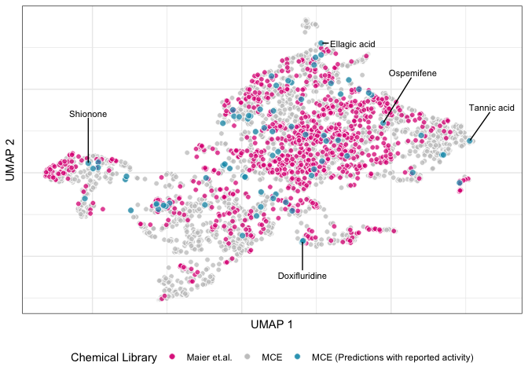
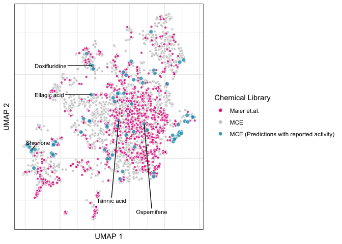
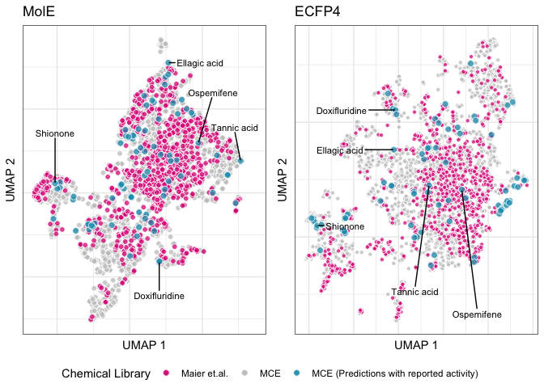
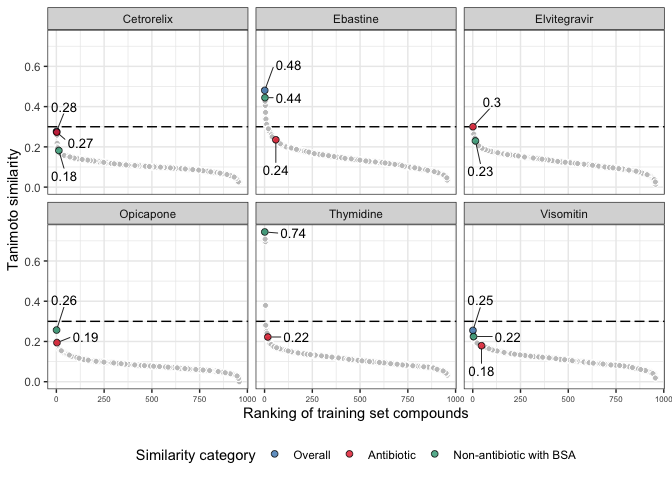

08.compare_mce_maier
================
Roberto Olayo Alarcon
2024-10-02

In this file we prepare the final figures from the data analysed in
`08.compare_mce_maier.ipynb`.

## Prepare directories.

``` r
OUTPUT_DIR <- "../data/08.compare_mce_maier/"
```

## Read data.

Here we read the UMAP coordinates.

``` r
# UMAP based on MolE representation
mole.umap <- read_tsv(file.path(OUTPUT_DIR, "mole_joint_umap.tsv.gz"), 
                      show_col_types = FALSE)

# UMAP based on ECFP4 representation
ecfp4.umap <- read_tsv(file.path(OUTPUT_DIR, "ecfp4_joint_umap.tsv.gz"), 
                      show_col_types = FALSE)


# Complete prediction set
completepreds <- read_excel("../data/04.new_predictions/mole_mce_predictions_litsearch.xlsx", sheet = "mole_prediction_overview")

# Literature search data. 
litsearch.mole <- read_excel("../data/04.new_predictions/mole_mce_predictions_litsearch.xlsx", sheet = "mole_over10")

mce_litexamples <- litsearch.mole %>% 
  filter(!is.na(`Reported Activity`),
         antibiotic == "not_abx") %>% 
  select(`Catalog Number`, `Reported Activity`) %>% 
  rename("chem_id" = "Catalog Number")

mce_litexamples %>% head()
```

    ## # A tibble: 6 × 2
    ##   chem_id   `Reported Activity`
    ##   <chr>     <chr>              
    ## 1 HY-N0797  Antibacterial      
    ## 2 HY-N0835  Antibacterial      
    ## 3 HY-16974  Antiparasitic      
    ## 4 HY-13948A Antiplasmodium     
    ## 5 HY-13553  Antifungal         
    ## 6 HY-P0017  Antibacterial

## Plot UMAP.

Plot the UMAP, highlighting some chemicals that are predicted to be
broad-spectrum and confirmed in the literature.

``` r
# Chemicals of interest

coi_df <- data.frame("chem_id" = c("HY-B0183", "HY-B0021", "HY-N0829", "HY-B0723", "HY-B2136" ),
                     "ProductName" = c("Ellagic acid", "Doxifluridine", "Shionone", "Ospemifene", "Tannic acid"))

coi_df
```

    ##    chem_id   ProductName
    ## 1 HY-B0183  Ellagic acid
    ## 2 HY-B0021 Doxifluridine
    ## 3 HY-N0829      Shionone
    ## 4 HY-B0723    Ospemifene
    ## 5 HY-B2136   Tannic acid

``` r
mce_litexamples.umap <- mce_litexamples %>% 
  left_join(mole.umap, by="chem_id") %>% 
  mutate(`Chemical Library` = "MCE (Predictions with reported activity)")
```

``` r
coi.mole <- coi_df %>% 
  left_join(mole.umap, by="chem_id")
```

``` r
mole.umap <- mole.umap %>% 
  mutate(keep = case_when(`Chemical Library` == "Maier et.al." ~ TRUE,
                          `Chemical Library` == "MCE" & chem_id %in% completepreds$`Catalog Number` ~ TRUE,
                          TRUE ~ FALSE)) %>% 
  filter(keep)


u.mole <- ggplot(mole.umap, aes(x=umap1, y=umap2, fill=`Chemical Library`)) +
  
  
  geom_point(size=2, color="white", shape=21, alpha=0.75) +
  geom_point(data = mce_litexamples.umap, color="white", size=2.5, shape=21, alpha=0.75) +
  
  
  geom_text_repel(data = coi.mole, aes(label=ProductName), 
                  max.overlaps = Inf, size=3, min.segment.length = 0, 
                  color="black", fontface="plain",
                  box.padding = 0.5,
                  nudge_x = if_else(coi.mole$ProductName %in% c("Ellagic acid", "Tannic acid", "Ospemifene"), 1, 0),
                  
                  nudge_y = case_when(coi.mole$ProductName %in% c("Ospemifene", "Shionone") ~ 3,
                                      coi.mole$ProductName %in% c("Doxifluridine") ~ -2,
                                      coi.mole$ProductName %in% c("Tannic acid") ~ 2,
                                      TRUE ~ 0)) +
  
  
  scale_fill_manual(values=c("#DE1F84", "#C5C5C5", "#1F9DBB")) +
  
  theme_bw() +
  
  theme(legend.position = "bottom",
        axis.ticks.x = element_blank(),
        axis.text.x = element_blank(),
        axis.ticks.y = element_blank(),
        axis.text.y = element_blank(),
        panel.background = element_rect(fill = "transparent", color=NA),
      plot.background = element_rect(fill = "transparent", colour = NA))  + 
  
labs(x="UMAP 1",
       y="UMAP 2")

u.mole
```

<!-- -->

``` r
ggsave(filename = file.path(OUTPUT_DIR, "mole_joint_umap.pdf"), plot=u.mole, dpi = 300,
       height = 15, width = 21, units="cm")

ggsave(filename = file.path(OUTPUT_DIR, "mole_joint_umap.png"), plot=u.mole, dpi = 300,
       height = 15, width = 21, units="cm")
```

``` r
mce_metadata <- completepreds %>% 
  select(`Catalog Number`, ProductName,  nk_total, antibiotic) %>% 
  rename("chem_id" = "Catalog Number") %>% 
  
  left_join(mce_litexamples, by="chem_id")
  

mole.umap %>% 
  left_join(mce_metadata, by="chem_id") %>% 
  select(-keep) %>% 
  rename("n_predicted_inhibited_strains" = "nk_total") %>% 
  write_tsv("../data/08.compare_mce_maier/umap_library_comparison.tsv")
```

The same but for ECFP4.

``` r
mce_litexamples.umap <- mce_litexamples %>% 
  left_join(ecfp4.umap, by="chem_id") %>% 
  mutate(`Chemical Library` = "MCE (Predictions with reported activity)")

coi.ecfp4 <- coi_df %>% 
  left_join(ecfp4.umap, by="chem_id")


u.ecfp4 <- ggplot(ecfp4.umap, aes(x=umap1, y=umap2, fill=`Chemical Library`)) +
  geom_point(size=1.5, color="white", shape=21, alpha=0.75) +
  geom_point(data = mce_litexamples.umap, color="white", size=2.5, shape=21, alpha=0.75) +
  
  
  geom_text_repel(data = coi.ecfp4, aes(label=ProductName), 
                  max.overlaps = Inf, size=3, min.segment.length = 0, 
                  color="black", fontface="plain",
                  box.padding = 0.5,
                   nudge_y = if_else(coi.mole$ProductName %in% c("Ospemifene", "Tannic acid"), -5, 0),
                  nudge_x = if_else(coi.mole$ProductName %in% c("Doxifluridine", "Ellagic acid"), -3, 0)) +
  
  
  scale_fill_manual(values=c("#DE1F84", "#C5C5C5","#1F9DBB")) +
  
  theme_bw() +
  
  theme(axis.ticks.x = element_blank(),
        axis.text.x = element_blank(),
        axis.ticks.y = element_blank(),
        axis.text.y = element_blank(),
        panel.background = element_rect(fill = "transparent", color=NA),
      plot.background = element_rect(fill = "transparent", colour = NA))  + 
  
labs(x="UMAP 1",
       y="UMAP 2")

u.ecfp4
```

<!-- -->

``` r
ggsave(filename = file.path(OUTPUT_DIR, "ecfp4_joint_umap.pdf"), plot=u.ecfp4, dpi = 300,
       height = 13, width = 19, units="cm")
```

## Comparing MolE and ECFP4

``` r
library(ggpubr)
```

``` r
umap.arranged <- ggarrange(u.mole + ggtitle("MolE"), 
          u.ecfp4 + ggtitle("ECFP4"), 
          common.legend = TRUE,
          legend="bottom")

umap.arranged
```

<!-- -->

``` r
ggsave(filename = file.path(OUTPUT_DIR, "joint_umap_panel.pdf"), plot=umap.arranged, dpi = 300,
       height = 11, width = 20, units="cm")
```

## Comparing molecular similarity.

``` r
# Read molecular similarity
mol.similarity <- read_tsv("../data/08.compare_mce_maier/ecfp4_distance_to_maier.tsv.gz", show_col_types = FALSE) %>% 
  # Make tidy form to ease handling
  pivot_longer(cols = -selected_chem, names_to = "prestwick_ID", values_to = "jaccard_distance") %>% 
  
  # Get tanimoto similarity
  mutate(tanimoto_similarity = 1-jaccard_distance) %>% 

  # Gather the ranking per molecule. Make sure to rank ties the same
  group_by(selected_chem) %>% 
  mutate(similarity_ranking = rank(-tanimoto_similarity, ties.method = "min"))

# Read prestwick metadata
maier_chems_metadata = read_excel("../raw_data/maier_microbiome/chem_library_info_SF1.xlsx") %>% 
  select(prestwick_ID, `chemical name`, `target species`) %>% 
  rename("prestwick_chemname" = "chemical name",
         "target_species" = "target species")


# Read screening results
maier_screening_results <- read_tsv("../data/01.prepare_training_data/maier_screening_results.tsv.gz", show_col_types = FALSE) %>% 
  # Gather chemicals used in training
  filter(prestwick_ID %in% unique(mol.similarity$prestwick_ID)) %>% 
  
  # Count number of strains inhibited
  pivot_longer(cols = -prestwick_ID, names_to = "strain", values_to = "growth_inhibition") %>% 
  group_by(prestwick_ID) %>% 
  summarise(n_inhibited_strains = sum(growth_inhibition)) %>% 
  ungroup()


# Join information
mol.similarity <- mol.similarity %>% 
  left_join(maier_chems_metadata, by="prestwick_ID") %>% 
  left_join(maier_screening_results, by="prestwick_ID")
```

Determine the most similar molecule percategory

``` r
# Overall
overall.most_similar <- mol.similarity %>% 
  filter(similarity_ranking == 1) %>% 
  # Thymidine has two molecules with equal ranking
  head(6) %>% 
  
  mutate(sim_category = "Overall")

# Most similar antibiotic
abx.most_similar <- mol.similarity %>% 
  filter(target_species == "bacteria") %>% 
  group_by(selected_chem) %>% 
  filter(similarity_ranking == min(similarity_ranking)) %>% 
  mutate(sim_category = "Antibiotic")

# Most similar non-antibiotic with broad spectrum activity
nonabx.bsa.most_similar <- mol.similarity %>% 
  filter(target_species != "bacteria",
         n_inhibited_strains >= 10) %>% 
  group_by(selected_chem) %>% 
  filter(similarity_ranking == min(similarity_ranking)) %>% 
  mutate(sim_category = "Non-antibiotic with BSA")


most_similar.df <- bind_rows(overall.most_similar, abx.most_similar, nonabx.bsa.most_similar) %>% 
  select(selected_chem, prestwick_ID, tanimoto_similarity, similarity_ranking, target_species, n_inhibited_strains, sim_category) %>% 
  
  # For some compounds, the same molecule is the most similar in more than one category. Let's choose the more specific annotation.
  group_by(selected_chem, prestwick_ID) %>% 
  slice_tail() %>% 
  
  # Prepare labelling
  mutate(tansim_label = round(tanimoto_similarity, 2),
         sim_category = factor(sim_category, levels=c("Overall", "Antibiotic", "Non-antibiotic with BSA")))
  
  
most_similar.df
```

    ## # A tibble: 15 × 8
    ## # Groups:   selected_chem, prestwick_ID [15]
    ##    selected_chem prestwick_ID tanimoto_similarity similarity_ranking
    ##    <chr>         <chr>                      <dbl>              <int>
    ##  1 Cetrorelix    Prestw-301                 0.276                  1
    ##  2 Cetrorelix    Prestw-408                 0.182                 13
    ##  3 Cetrorelix    Prestw-919                 0.273                  2
    ##  4 Ebastine      Prestw-1009                0.235                 59
    ##  5 Ebastine      Prestw-138                 0.444                  2
    ##  6 Ebastine      Prestw-707                 0.481                  1
    ##  7 Elvitegravir  Prestw-1303                0.3                    1
    ##  8 Elvitegravir  Prestw-205                 0.230                 14
    ##  9 Opicapone     Prestw-1403                0.257                  1
    ## 10 Opicapone     Prestw-81                  0.194                  3
    ## 11 Thymidine     Prestw-1415                0.744                  1
    ## 12 Thymidine     Prestw-544                 0.222                 17
    ## 13 Visomitin     Prestw-1078                0.179                 46
    ## 14 Visomitin     Prestw-1288                0.255                  1
    ## 15 Visomitin     Prestw-270                 0.224                  4
    ## # ℹ 4 more variables: target_species <chr>, n_inhibited_strains <dbl>,
    ## #   sim_category <fct>, tansim_label <dbl>

``` r
similarity.chosen <- ggplot(mol.similarity, aes(x=similarity_ranking, y=tanimoto_similarity)) +
  geom_hline(yintercept = 0.3, linetype="longdash") +
  
  geom_point(size=1.8, color="white", shape=21, alpha=1, fill="#C5C5C5") +
  geom_point(data=most_similar.df, aes(fill=sim_category, shape=sim_category), size=2, 
             color="black", shape=21, alpha=0.75) +
  
  scale_fill_manual(values=c("#377eb8", "#e41a1c", "#1b9e77")) +
  
  
  geom_text_repel(data = most_similar.df, aes(label=tansim_label), 
                  max.overlaps = Inf, size=3.5, 
                  min.segment.length = 0, 
                  color="black", 
                  fontface="plain",
                  point.padding = 0.2,
                  box.padding = 0.2,
                  segment.size=0.3,
                  
                  nudge_y = case_when(most_similar.df$selected_chem == "Cetrorelix" & most_similar.df$sim_category == "Non-antibiotic with BSA" ~ -0.125,
                                      most_similar.df$selected_chem == "Cetrorelix" & most_similar.df$sim_category == "Overall" ~ 0.125,
                                      most_similar.df$selected_chem == "Cetrorelix" & most_similar.df$sim_category == "Antibiotic" ~ -0.05,
                                      
                                      most_similar.df$selected_chem == "Elvitegravir" & most_similar.df$sim_category == "Non-antibiotic with BSA" ~ -0.15,
                                      most_similar.df$selected_chem == "Elvitegravir" & most_similar.df$sim_category == "Antibiotic" ~ 0.1255,
                                      
                                      most_similar.df$selected_chem == "Opicapone" & most_similar.df$sim_category == "Antibiotic" ~ 0.03,
                                      most_similar.df$selected_chem == "Opicapone" & most_similar.df$sim_category == "Non-antibiotic with BSA" ~ 0.15,
                                      
                                      most_similar.df$selected_chem == "Visomitin" & most_similar.df$sim_category == "Overall" ~ 0.15,
                                      most_similar.df$selected_chem == "Visomitin" & most_similar.df$sim_category == "Antibiotic" ~ -0.125,
                                      
                                      most_similar.df$selected_chem == "Ebastine" & most_similar.df$sim_category == "Antibiotic" ~ -0.15,
                                      most_similar.df$selected_chem == "Ebastine" & most_similar.df$sim_category == "Overall" ~ 0.125,
                                      
                                      TRUE ~ 0),
                  
                  nudge_x = case_when(most_similar.df$selected_chem == "Ebastine" & most_similar.df$sim_category == "Non-antibiotic with BSA" ~ 125,
                                      most_similar.df$selected_chem == "Ebastine" & most_similar.df$sim_category == "Overall" ~ 125,
                                      
                                      most_similar.df$selected_chem == "Thymidine" & most_similar.df$sim_category == "Non-antibiotic with BSA" ~ 150,
                                      most_similar.df$selected_chem == "Thymidine" & most_similar.df$sim_category == "Antibiotic" ~ 150,
                                      
                                      most_similar.df$selected_chem == "Opicapone" & most_similar.df$sim_category == "Antibiotic" ~ 150,
                                      
                                      most_similar.df$selected_chem == "Elvitegravir" & most_similar.df$sim_category == "Antibiotic" ~ 100,
                                      
                                      most_similar.df$selected_chem == "Visomitin" & most_similar.df$sim_category == "Non-antibiotic with BSA" ~ 180,
                                      
                                      most_similar.df$selected_chem == "Cetrorelix" & most_similar.df$sim_category == "Antibiotic" ~ 125,
                                      TRUE ~ 0)) +
  
  
  facet_wrap(~selected_chem) +
  
  theme_bw() +
  theme(legend.position = "bottom",
        axis.text.x = element_text(size=6)) +
  labs(x="Ranking of training set compounds",
       y="Tanimoto similarity",
       fill = "Similarity category")
similarity.chosen
```

<!-- -->

``` r
ggsave(plot=similarity.chosen, filename = "../data/08.compare_mce_maier/similarity_to_maier.png",
       dpi = 300, width = 21, height = 12.5, units="cm")

ggsave(plot=similarity.chosen, filename = "../data/08.compare_mce_maier/similarity_to_maier.pdf",
       dpi = 300, width = 21, height = 12.5, units="cm")
```

``` r
most_similar_metadata <- most_similar.df %>% 
  unite("selected_prest", c(selected_chem, prestwick_ID), sep=":") %>% 
  select(selected_prest, sim_category)
```

``` r
mol.similarity %>% 
  unite("selected_prest", c(selected_chem, prestwick_ID), sep=":", remove=FALSE) %>% 
  
  left_join(most_similar_metadata, by="selected_prest") %>% 
  select(-selected_prest) %>% 
  
  arrange(selected_chem, similarity_ranking) %>% 
  
  rename("measured_n_inhibited_strains" = "n_inhibited_strains",
         "most_similar_category" = "sim_category") %>%
  write_tsv("../data/08.compare_mce_maier/selected_prestwick_tanimoto.tsv")
```

## Session Info:

``` r
sessionInfo()
```

    ## R version 4.3.1 (2023-06-16)
    ## Platform: x86_64-apple-darwin20 (64-bit)
    ## Running under: macOS Ventura 13.4.1
    ## 
    ## Matrix products: default
    ## BLAS:   /Library/Frameworks/R.framework/Versions/4.3-x86_64/Resources/lib/libRblas.0.dylib 
    ## LAPACK: /Library/Frameworks/R.framework/Versions/4.3-x86_64/Resources/lib/libRlapack.dylib;  LAPACK version 3.11.0
    ## 
    ## locale:
    ## [1] en_US.UTF-8/en_US.UTF-8/en_US.UTF-8/C/en_US.UTF-8/en_US.UTF-8
    ## 
    ## time zone: Europe/Berlin
    ## tzcode source: internal
    ## 
    ## attached base packages:
    ## [1] stats     graphics  grDevices utils     datasets  methods   base     
    ## 
    ## other attached packages:
    ##  [1] ggpubr_0.6.0    readxl_1.4.2    ggrepel_0.9.3   lubridate_1.9.2
    ##  [5] forcats_1.0.0   stringr_1.5.0   dplyr_1.1.2     purrr_1.0.2    
    ##  [9] readr_2.1.4     tidyr_1.3.0     tibble_3.2.1    ggplot2_3.4.4  
    ## [13] tidyverse_2.0.0
    ## 
    ## loaded via a namespace (and not attached):
    ##  [1] utf8_1.2.4        generics_0.1.3    rstatix_0.7.2     stringi_1.7.12   
    ##  [5] hms_1.1.3         digest_0.6.33     magrittr_2.0.3    evaluate_0.21    
    ##  [9] grid_4.3.1        timechange_0.2.0  fastmap_1.1.1     cellranger_1.1.0 
    ## [13] backports_1.4.1   gridExtra_2.3     fansi_1.0.6       scales_1.3.0     
    ## [17] textshaping_0.3.6 abind_1.4-5       cli_3.6.3         rlang_1.1.4      
    ## [21] crayon_1.5.2      cowplot_1.1.1     bit64_4.0.5       munsell_0.5.0    
    ## [25] withr_2.5.2       yaml_2.3.7        tools_4.3.1       parallel_4.3.1   
    ## [29] tzdb_0.4.0        ggsignif_0.6.4    colorspace_2.1-0  broom_1.0.5      
    ## [33] vctrs_0.6.5       R6_2.5.1          lifecycle_1.0.4   car_3.1-2        
    ## [37] bit_4.0.5         vroom_1.6.3       ragg_1.2.5        pkgconfig_2.0.3  
    ## [41] pillar_1.9.0      gtable_0.3.4      glue_1.7.0        Rcpp_1.0.13      
    ## [45] systemfonts_1.0.4 highr_0.10        xfun_0.40         tidyselect_1.2.0 
    ## [49] rstudioapi_0.15.0 knitr_1.43        farver_2.1.1      htmltools_0.5.6  
    ## [53] carData_3.0-5     rmarkdown_2.24    labeling_0.4.3    compiler_4.3.1
